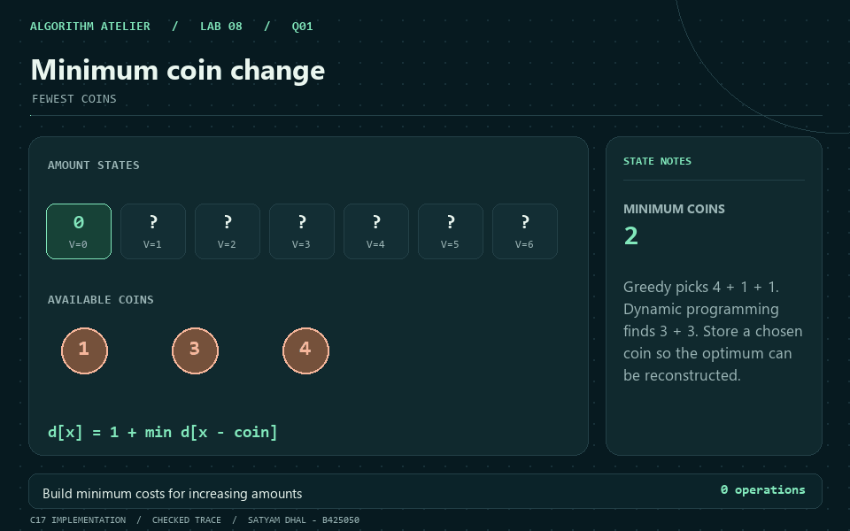
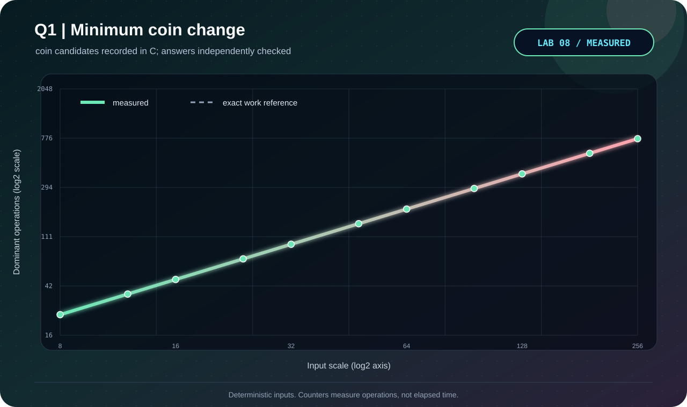

<p align="center"></p>

# Q1 · Minimum coin change

[← Lab 08](../README.md) · [Official question sheet](../Problem-Sheet-Lab-08.pdf) · [← Lab 07](../../lab7/README.md) · [Q2 →](../Q-2/README.md)

**FEWEST COINS** · `Theta(cV) time / Theta(V) space`

## Input and required output

`c V`, followed by `c` distinct positive coin values.

`0 <= c <= 256`, `0 <= V <= 200000`; denominations fit a positive C `int`.

The empty target needs zero coins. An unreachable positive target returns **-1**. Duplicate denominations are rejected.

## State and transition

Define `d[x]` as the minimum coins forming amount x; `d[0]=0`.

`d[x] = min(1 + d[x-c])` over denominations c<=x with reachable remainder.

## Why it works

All denominations are positive, so every predecessor amount is smaller. Increasing x solves every dependency before it is used. Every solution has a final coin; taking the best such coin considers all feasible solutions.

## Reconstruction and output

Store the winning denomination in `pick[x]`. Repeatedly subtract it from V. The chosen coins sum to V and their count equals d[V].

## Complexity derivation

There are V nonzero amount states and c candidate checks per state: exactly cV checks. Arrays have V+1 cells. The bound is pseudo-polynomial in the numeric amount, not polynomial in the bit length of V.

## Run the C solution

From this question folder:

```bash
gcc -std=c17 -O2 -Wall -Wextra -Wpedantic -Werror q1_minimum_coin_change.c -lm -o q1
./q1 < q1_sample_input.txt
./q1 --json < q1_sample_input.txt  # result, counters, and state trace
```

In PowerShell, after running `python tools/build.py` from `lab8`:

```powershell
Get-Content q1_sample_input.txt | ..\bin\q1_minimum_coin_change.exe
```

### Sample input

```text
3 6
1 3 4
```

### Captured answer

```text
Minimum coins: 2
Chosen coins: [3,3]
Candidate checks: 18
```

## Independent validation

Breadth-first shortest paths on amount vertices, plus denomination/sum/count checks of the witness.

The shared [validator](../tools/validate.py) also checks malformed inputs and exact operation counters. See the [verification report](../VERIFICATION.md).

## Measured evidence

<p align="center"></p>

Measured primitive: **coin candidates**. The [dataset](q1_experimental_data.dat) comes from C counters after its answer passes the independent oracle. Axes show actual values on logarithmic scales; these are operation counts, not timings.

The dashed reference is the exact work count derived above; overlapping curves confirm the instrumented count.

The GIF illustrates the checked [C sample trace](q1_sample_trace.json). Use the [static frame](q1_walkthrough.png) if you prefer a still image.

## Files

| Artifact | Purpose |
|---|---|
| [q1_minimum_coin_change.c](q1_minimum_coin_change.c) | C17 solution, readable output and JSON trace |
| [Sample input](q1_sample_input.txt) · [sample output](q1_sample_output.txt) | Reproducible demonstration |
| [Measured data](q1_experimental_data.dat) · [experiment transcript](q1_experiment_output.txt) | Oracle-checked scaling trials |
| [C plotter](q1_plot_evidence.c) · [SVG chart](q1_evidence.svg) | Regenerate visual evidence without Gnuplot |
| [GIF walkthrough](q1_walkthrough.gif) · [static frame](q1_walkthrough.png) | Algorithm story |

[← Lab 07](../../lab7/README.md) · [Lab 08 dashboard](../README.md) · [Q2 →](../Q-2/README.md)
