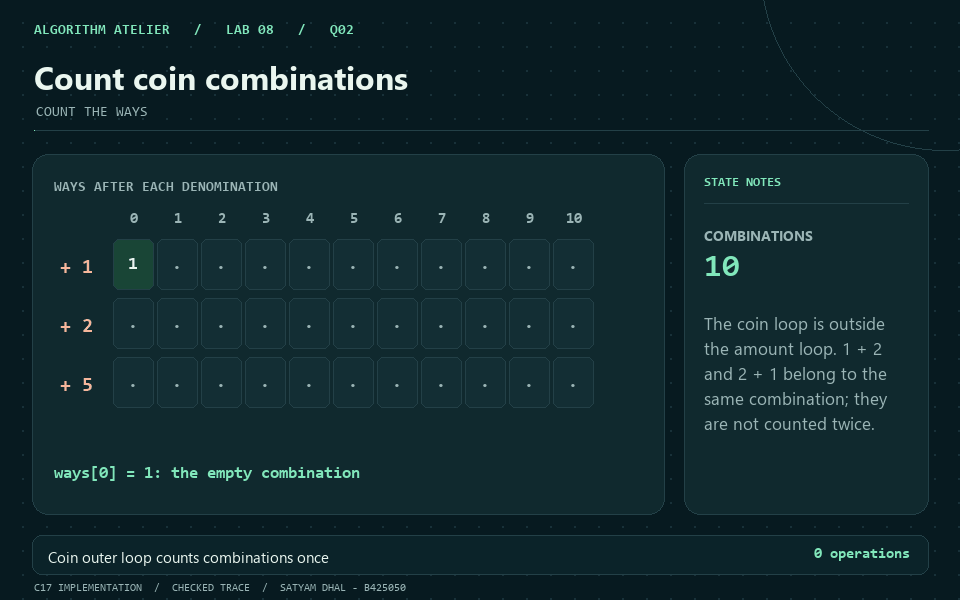
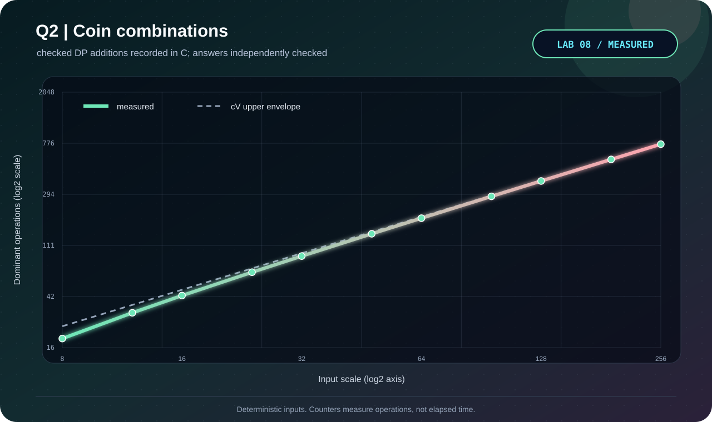

<p align="center"></p>

# Q2 · Count coin combinations

[← Lab 08](../README.md) · [Official question sheet](../Problem-Sheet-Lab-08.pdf) · [← Q1](../Q-1/README.md) · [Q3 →](../Q-3/README.md)

**COUNT THE WAYS** · `O(cV) time / Theta(V) space`

## Input and required output

`c V`, followed by `c` distinct positive coin values.

Same bounds as Q1. Counts use `uint64_t`.

There is one way to make zero: choose no coins. Checked addition rejects overflow rather than printing a wrapped count.

## State and transition

After processing the first i denominations, `ways[x]` counts combinations using only those denominations; initially `ways[0]=1`.

`ways[x] += ways[x-coin]`, scanning amounts upward for each outer-loop coin.

## Why it works

A combination using the current coin removes one such coin and maps to a smaller-amount combination using the same allowed prefix. A combination not using that coin retains its previous count. The outer coin loop gives one canonical order for every multiset.

## Reconstruction and output

Q2 requests a total count. The stage-by-stage animation shows how that count is accumulated; permutations are not separate answers.

## Complexity derivation

Exactly `sum max(0,V-c_i+1)` additions, at most cV for positive V. The array needs V+1 cells. This is pseudo-polynomial; overflow in any intermediate count is explicitly rejected.

## Run the C solution

From this question folder:

```bash
gcc -std=c17 -O2 -Wall -Wextra -Wpedantic -Werror q2_coin_change_ways.c -lm -o q2
./q2 < q2_sample_input.txt
./q2 --json < q2_sample_input.txt  # result, counters, and state trace
```

In PowerShell, after running `python tools/build.py` from `lab8`:

```powershell
Get-Content q2_sample_input.txt | ..\bin\q2_coin_change_ways.exe
```

### Sample input

```text
3 10
1 2 5
```

### Captured answer

```text
Distinct combinations: 10
DP additions: 25
```

## Independent validation

Recursive enumeration of multiplicities for each denomination, without ordering the coins.

The shared [validator](../tools/validate.py) also checks malformed inputs and exact operation counters. See the [verification report](../VERIFICATION.md).

## Measured evidence

<p align="center"></p>

Measured primitive: **checked DP additions**. The [dataset](q2_experimental_data.dat) comes from C counters after its answer passes the independent oracle. Axes show actual values on logarithmic scales; these are operation counts, not timings.

The dashed reference is the cV upper envelope; actual additions omit amounts below each coin.

The GIF illustrates the checked [C sample trace](q2_sample_trace.json). Use the [static frame](q2_walkthrough.png) if you prefer a still image.

## Files

| Artifact | Purpose |
|---|---|
| [q2_coin_change_ways.c](q2_coin_change_ways.c) | C17 solution, readable output and JSON trace |
| [Sample input](q2_sample_input.txt) · [sample output](q2_sample_output.txt) | Reproducible demonstration |
| [Measured data](q2_experimental_data.dat) · [experiment transcript](q2_experiment_output.txt) | Oracle-checked scaling trials |
| [C plotter](q2_plot_evidence.c) · [SVG chart](q2_evidence.svg) | Regenerate visual evidence without Gnuplot |
| [GIF walkthrough](q2_walkthrough.gif) · [static frame](q2_walkthrough.png) | Algorithm story |

[← Q1](../Q-1/README.md) · [Lab 08 dashboard](../README.md) · [Q3 →](../Q-3/README.md)
