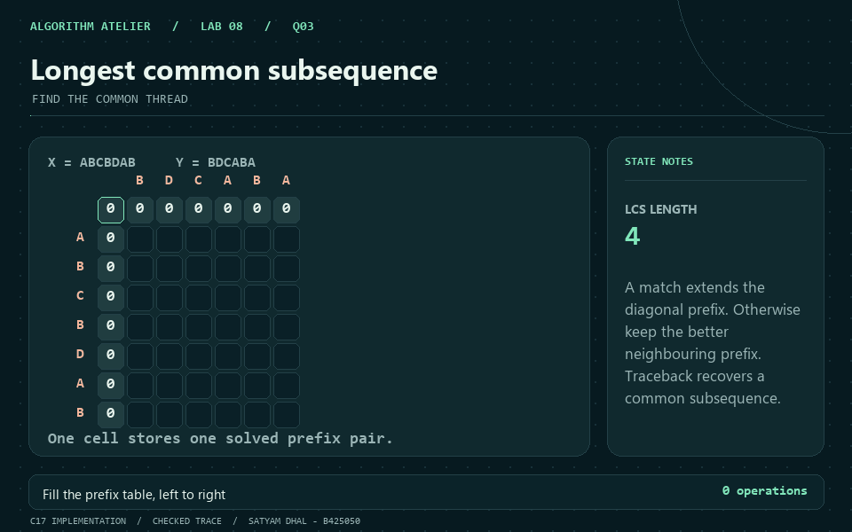
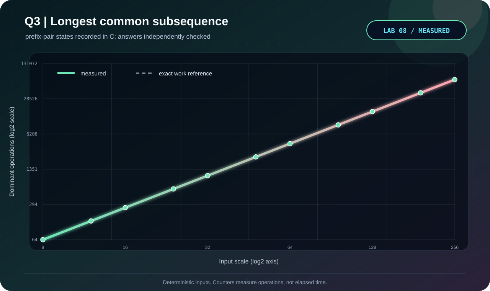

<p align="center"></p>

# Q3 · Longest common subsequence

[← Lab 08](../README.md) · [Official question sheet](../Problem-Sheet-Lab-08.pdf) · [← Q2](../Q-2/README.md) · [Q4 →](../Q-4/README.md)

**FIND THE COMMON THREAD** · `Theta(mn) time / Theta(mn) space`

## Input and required output

Two complete lines: sequence X, then sequence Y.

Printable ASCII, up to 2000 characters per line; a blank line represents an empty string.

Whitespace within each line is part of the sequence. Ties prefer the upper DP cell, so repeated runs reconstruct the same LCS.

## State and transition

`L[i,j]` is the LCS length of prefixes X[0:i] and Y[0:j]. Empty prefixes have length zero.

`L[i,j] = 1+L[i-1,j-1]` on a match; otherwise `max(L[i-1,j], L[i,j-1])`.

## Why it works

Matching terminal symbols can extend an optimum common prefix. On a mismatch, an optimum cannot use both terminal symbols together, so discarding one covers the possibilities. Increasing prefix lengths respect the dependency order.

## Reconstruction and output

Backtrack from (m,n). Matching symbols move diagonally and are collected in reverse; otherwise follow the larger neighbour. Reverse the collected sequence.

## Complexity derivation

Exactly mn interior states, each doing constant work. The full (m+1)(n+1) table supports traceback. Including empty inputs, bounds are O((m+1)(n+1)) time/space; for positive m,n they are Theta(mn).

## Run the C solution

From this question folder:

```bash
gcc -std=c17 -O2 -Wall -Wextra -Wpedantic -Werror q3_lcs_traceback.c -lm -o q3
./q3 < q3_sample_input.txt
./q3 --json < q3_sample_input.txt  # result, counters, and state trace
```

In PowerShell, after running `python tools/build.py` from `lab8`:

```powershell
Get-Content q3_sample_input.txt | ..\bin\q3_lcs_traceback.exe
```

### Sample input

```text
ABCBDAB
BDCABA
```

### Captured answer

```text
LCS length: 4
Subsequence: BCBA
Prefix-pair states: 42
```

## Independent validation

Enumerate subsequences of short X; check membership in Y. Larger trials use a rolling-row length oracle. Every printed witness is checked against both originals.

The shared [validator](../tools/validate.py) also checks malformed inputs and exact operation counters. See the [verification report](../VERIFICATION.md).

## Measured evidence

<p align="center"></p>

Measured primitive: **prefix-pair states**. The [dataset](q3_experimental_data.dat) comes from C counters after its answer passes the independent oracle. Axes show actual values on logarithmic scales; these are operation counts, not timings.

The dashed reference is the exact work count derived above; overlapping curves confirm the instrumented count.

The GIF illustrates the checked [C sample trace](q3_sample_trace.json). Use the [static frame](q3_walkthrough.png) if you prefer a still image.

## Files

| Artifact | Purpose |
|---|---|
| [q3_lcs_traceback.c](q3_lcs_traceback.c) | C17 solution, readable output and JSON trace |
| [Sample input](q3_sample_input.txt) · [sample output](q3_sample_output.txt) | Reproducible demonstration |
| [Measured data](q3_experimental_data.dat) · [experiment transcript](q3_experiment_output.txt) | Oracle-checked scaling trials |
| [C plotter](q3_plot_evidence.c) · [SVG chart](q3_evidence.svg) | Regenerate visual evidence without Gnuplot |
| [GIF walkthrough](q3_walkthrough.gif) · [static frame](q3_walkthrough.png) | Algorithm story |

[← Q2](../Q-2/README.md) · [Lab 08 dashboard](../README.md) · [Q4 →](../Q-4/README.md)
