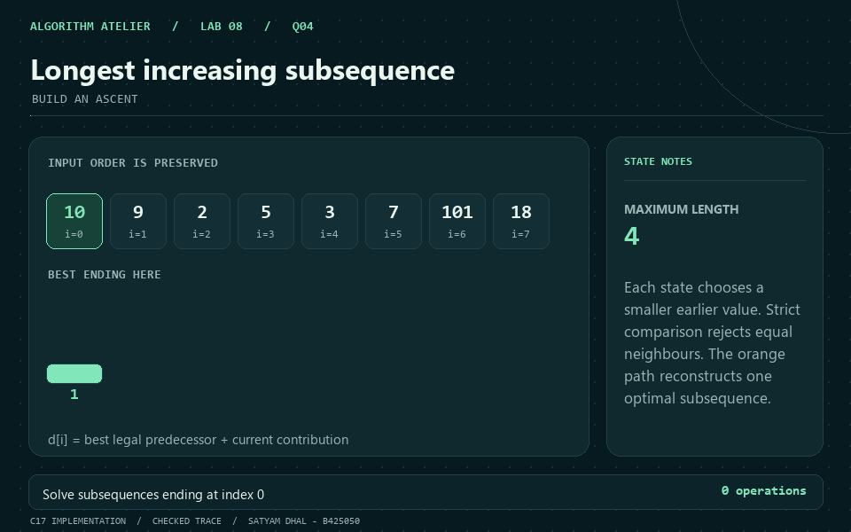
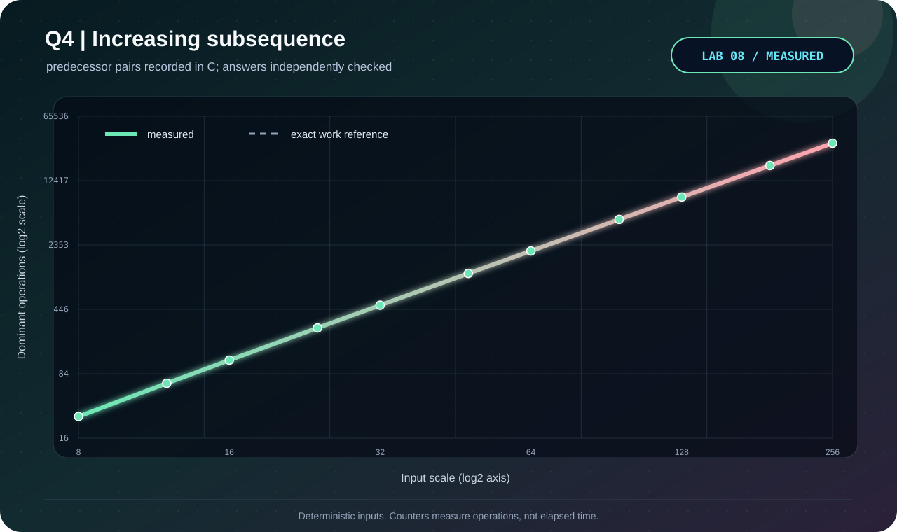

<p align="center"></p>

# Q4 · Longest increasing subsequence

[← Lab 08](../README.md) · [Official question sheet](../Problem-Sheet-Lab-08.pdf) · [← Q3](../Q-3/README.md) · [Q5 →](../Q-5/README.md)

**BUILD AN ASCENT** · `Theta(n^2) time / Theta(n) space`

## Input and required output

`n`, followed by `n` signed integer array elements.

`0 <= n <= 10000`; values fit `int64_t`.

Strictly increasing means `<`, never `<=`. Empty input has length zero. The implementation deliberately uses quadratic DP for this lab.

## State and transition

`L[i]` is the best increasing subsequence length ending exactly at index i.

`L[i] = 1 + max L[j]` over j<i with A[j]<A[i]; default 1.

## Why it works

The predecessor of any nontrivial increasing subsequence lies earlier and is smaller. Each valid predecessor can be extended, so choosing the best produces the optimal ending-at-i result. The overall optimum is max L[i].

## Reconstruction and output

Remember the winning predecessor index, follow the chain from the first maximum endpoint, then reverse it.

## Complexity derivation

Every earlier/later pair is checked exactly once: n(n-1)/2 comparisons. Values, lengths, and parents occupy Theta(n) space. A faster patience-sorting oracle is used for validation, while this submitted solution is DP.

## Run the C solution

From this question folder:

```bash
gcc -std=c17 -O2 -Wall -Wextra -Wpedantic -Werror q4_longest_increasing_subsequence.c -lm -o q4
./q4 < q4_sample_input.txt
./q4 --json < q4_sample_input.txt  # result, counters, and state trace
```

In PowerShell, after running `python tools/build.py` from `lab8`:

```powershell
Get-Content q4_sample_input.txt | ..\bin\q4_longest_increasing_subsequence.exe
```

### Sample input

```text
8
10 9 2 5 3 7 101 18
```

### Captured answer

```text
LIS length: 4
Strictly increasing subsequence: [2,5,7,101]
Pair checks: 28
```

## Independent validation

Exhaustive subsequence enumeration on small arrays; an independent patience-sorting length oracle on scaling trials; strict-order and original-order witness checks.

The shared [validator](../tools/validate.py) also checks malformed inputs and exact operation counters. See the [verification report](../VERIFICATION.md).

## Measured evidence

<p align="center"></p>

Measured primitive: **predecessor pairs**. The [dataset](q4_experimental_data.dat) comes from C counters after its answer passes the independent oracle. Axes show actual values on logarithmic scales; these are operation counts, not timings.

The dashed reference is the exact work count derived above; overlapping curves confirm the instrumented count.

The GIF illustrates the checked [C sample trace](q4_sample_trace.json). Use the [static frame](q4_walkthrough.png) if you prefer a still image.

## Files

| Artifact | Purpose |
|---|---|
| [q4_longest_increasing_subsequence.c](q4_longest_increasing_subsequence.c) | C17 solution, readable output and JSON trace |
| [Sample input](q4_sample_input.txt) · [sample output](q4_sample_output.txt) | Reproducible demonstration |
| [Measured data](q4_experimental_data.dat) · [experiment transcript](q4_experiment_output.txt) | Oracle-checked scaling trials |
| [C plotter](q4_plot_evidence.c) · [SVG chart](q4_evidence.svg) | Regenerate visual evidence without Gnuplot |
| [GIF walkthrough](q4_walkthrough.gif) · [static frame](q4_walkthrough.png) | Algorithm story |

[← Q3](../Q-3/README.md) · [Lab 08 dashboard](../README.md) · [Q5 →](../Q-5/README.md)
