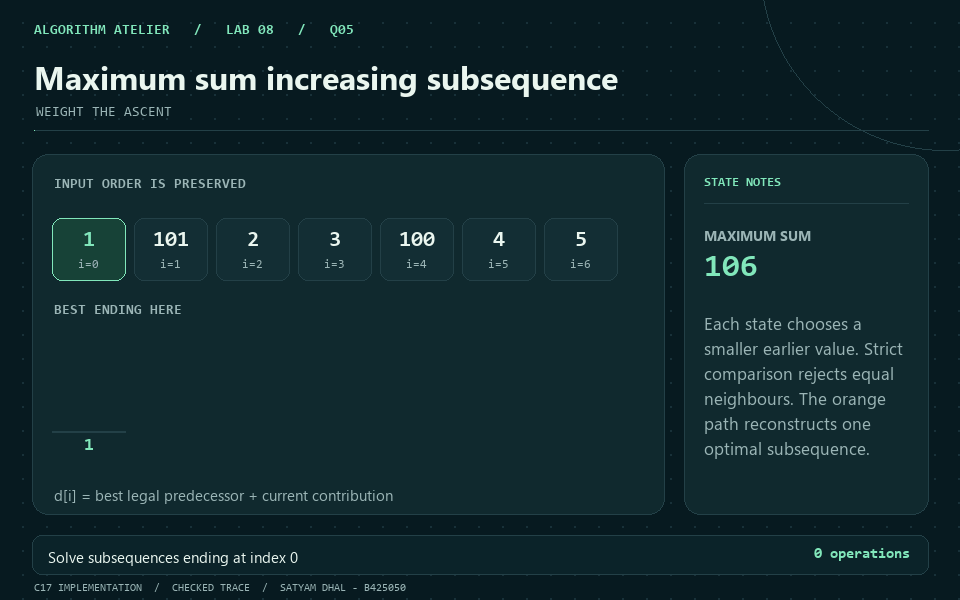
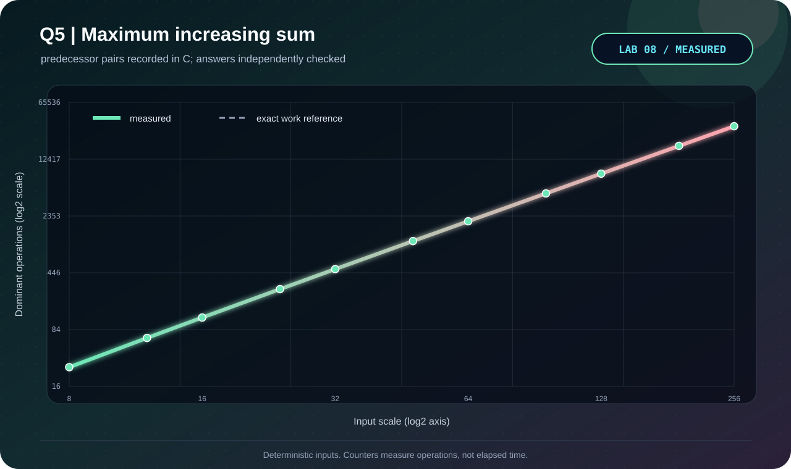

<p align="center"></p>

# Q5 · Maximum sum increasing subsequence

[← Lab 08](../README.md) · [Official question sheet](../Problem-Sheet-Lab-08.pdf) · [← Q4](../Q-4/README.md) · [Q6 →](../Q-6/README.md)

**WEIGHT THE ASCENT** · `Theta(n^2) time / Theta(n) space`

## Input and required output

`n`, followed by `n` positive array elements.

`0 <= n <= 10000`; values and sums fit `uint64_t`.

Zero and negative values are rejected as the handout specifies positive integers. Any overflowing candidate sum produces an explicit error.

## State and transition

`S[i]` is the maximum sum of an increasing subsequence ending at i.

`S[i] = A[i] + max(0, S[j])` over j<i with A[j]<A[i].

## Why it works

Every answer ending at i is either the singleton A[i] or extends a legal earlier endpoint. Maximizing their contributions proves the transition. Positive inputs make an empty predecessor contribute zero.

## Reconstruction and output

Follow predecessor indices from the endpoint with maximum sum. The recovered values must be strictly increasing, preserve input order, and sum to the reported optimum.

## Complexity derivation

Exactly n(n-1)/2 predecessor checks. The value, sum, and parent arrays require Theta(n) space. Arithmetic uses checked unsigned addition.

## Run the C solution

From this question folder:

```bash
gcc -std=c17 -O2 -Wall -Wextra -Wpedantic -Werror q5_maximum_sum_increasing_subsequence.c -lm -o q5
./q5 < q5_sample_input.txt
./q5 --json < q5_sample_input.txt  # result, counters, and state trace
```

In PowerShell, after running `python tools/build.py` from `lab8`:

```powershell
Get-Content q5_sample_input.txt | ..\bin\q5_maximum_sum_increasing_subsequence.exe
```

### Sample input

```text
7
1 101 2 3 100 4 5
```

### Captured answer

```text
Maximum increasing sum: 106
Chosen subsequence: [1,2,3,100]
Pair checks: 21
```

## Independent validation

Exhaustive subsequences on small cases and an independent coordinate-compressed Fenwick maximum oracle on larger cases.

The shared [validator](../tools/validate.py) also checks malformed inputs and exact operation counters. See the [verification report](../VERIFICATION.md).

## Measured evidence

<p align="center"></p>

Measured primitive: **predecessor pairs**. The [dataset](q5_experimental_data.dat) comes from C counters after its answer passes the independent oracle. Axes show actual values on logarithmic scales; these are operation counts, not timings.

The dashed reference is the exact work count derived above; overlapping curves confirm the instrumented count.

The GIF illustrates the checked [C sample trace](q5_sample_trace.json). Use the [static frame](q5_walkthrough.png) if you prefer a still image.

## Files

| Artifact | Purpose |
|---|---|
| [q5_maximum_sum_increasing_subsequence.c](q5_maximum_sum_increasing_subsequence.c) | C17 solution, readable output and JSON trace |
| [Sample input](q5_sample_input.txt) · [sample output](q5_sample_output.txt) | Reproducible demonstration |
| [Measured data](q5_experimental_data.dat) · [experiment transcript](q5_experiment_output.txt) | Oracle-checked scaling trials |
| [C plotter](q5_plot_evidence.c) · [SVG chart](q5_evidence.svg) | Regenerate visual evidence without Gnuplot |
| [GIF walkthrough](q5_walkthrough.gif) · [static frame](q5_walkthrough.png) | Algorithm story |

[← Q4](../Q-4/README.md) · [Lab 08 dashboard](../README.md) · [Q6 →](../Q-6/README.md)
