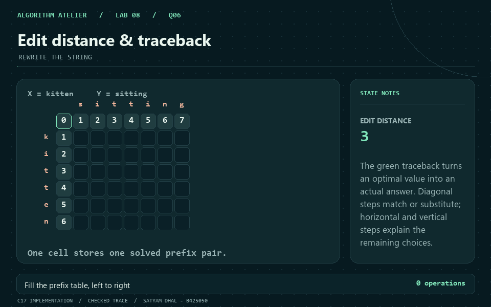
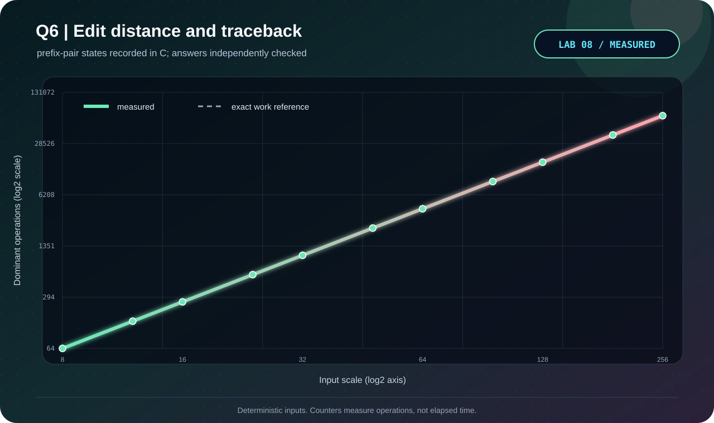

<p align="center"></p>

# Q6 · Edit distance & traceback

[← Lab 08](../README.md) · [Official question sheet](../Problem-Sheet-Lab-08.pdf) · [← Q5](../Q-5/README.md) · [Q7 →](../Q-7/README.md)

**REWRITE THE STRING** · `Theta(mn) time / Theta(mn) space`

## Input and required output

Two complete lines: original A, then desired B.

Printable ASCII, up to 2000 characters per line; empty strings use blank lines.

Each operation costs one. Output is in forward order. M=match, S=substitute, D=delete, I=insert. Operation codes distinguish a real hyphen from a displayed gap.

## State and transition

`D[i,j]` is the minimum edits turning prefix A[0:i] into B[0:j]; D[i,0]=i, D[0,j]=j.

`D[i,j] = min(D[i-1,j]+1, D[i,j-1]+1, D[i-1,j-1]+[A[i-1]!=B[j-1]])`.

## Why it works

The final alignment action deletes, inserts, or matches/substitutes the terminal symbols. These cases exhaust the permitted actions, and their smaller prefix problems have already been solved.

## Reconstruction and output

Backtrack with a deterministic diagonal/delete/insert tie order. Reverse the recorded alignment columns and print a forward edit script. Matches cost zero; all other actions cost one.

## Complexity derivation

mn interior states, constant work each; O(m+n) boundary initialization and traceback. Full table space is O((m+1)(n+1)); nonempty scaling experiments expose Theta(mn).

## Run the C solution

From this question folder:

```bash
gcc -std=c17 -O2 -Wall -Wextra -Wpedantic -Werror q6_edit_distance_traceback.c -lm -o q6
./q6 < q6_sample_input.txt
./q6 --json < q6_sample_input.txt  # result, counters, and state trace
```

In PowerShell, after running `python tools/build.py` from `lab8`:

```powershell
Get-Content q6_sample_input.txt | ..\bin\q6_edit_distance_traceback.exe
```

### Sample input

```text
kitten
sitting
```

### Captured answer

```text
Edit distance: 3
Traceback (forward; M=match S=substitute D=delete I=insert):
S: k -> s
M: i -> i
M: t -> t
M: t -> t
S: e -> i
M: n -> n
I: - -> g
Prefix-pair states: 42
```

## Independent validation

Rolling-row distance oracle plus a full replay: source columns recreate A, destination columns recreate B, and non-match operations equal the distance.

The shared [validator](../tools/validate.py) also checks malformed inputs and exact operation counters. See the [verification report](../VERIFICATION.md).

## Measured evidence

<p align="center"></p>

Measured primitive: **prefix-pair states**. The [dataset](q6_experimental_data.dat) comes from C counters after its answer passes the independent oracle. Axes show actual values on logarithmic scales; these are operation counts, not timings.

The dashed reference is the exact work count derived above; overlapping curves confirm the instrumented count.

The GIF illustrates the checked [C sample trace](q6_sample_trace.json). Use the [static frame](q6_walkthrough.png) if you prefer a still image.

## Files

| Artifact | Purpose |
|---|---|
| [q6_edit_distance_traceback.c](q6_edit_distance_traceback.c) | C17 solution, readable output and JSON trace |
| [Sample input](q6_sample_input.txt) · [sample output](q6_sample_output.txt) | Reproducible demonstration |
| [Measured data](q6_experimental_data.dat) · [experiment transcript](q6_experiment_output.txt) | Oracle-checked scaling trials |
| [C plotter](q6_plot_evidence.c) · [SVG chart](q6_evidence.svg) | Regenerate visual evidence without Gnuplot |
| [GIF walkthrough](q6_walkthrough.gif) · [static frame](q6_walkthrough.png) | Algorithm story |

[← Q5](../Q-5/README.md) · [Lab 08 dashboard](../README.md) · [Q7 →](../Q-7/README.md)
