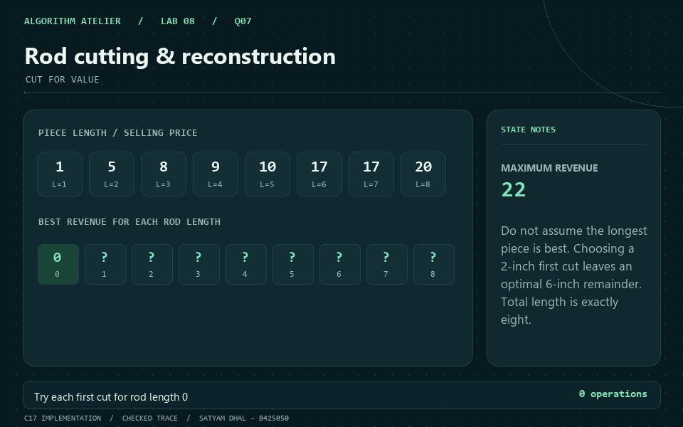
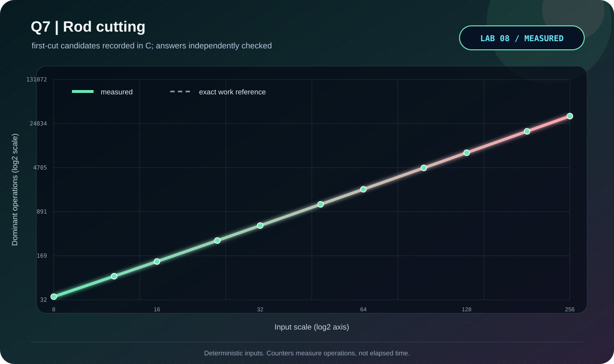

<p align="center"></p>

# Q7 · Rod cutting & reconstruction

[← Lab 08](../README.md) · [Official question sheet](../Problem-Sheet-Lab-08.pdf) · [← Q6](../Q-6/README.md) · [Q8 →](../Q-8/README.md)

**CUT FOR VALUE** · `Theta(n^2) time / Theta(n) space`

## Input and required output

`n`, followed by prices `p1 ... pn`.

`0 <= n <= 5000`; each signed price satisfies `abs(price) <= INT64_MAX/n` for n>0.

Prices may be negative: the entire rod must still be sold. Every reconstruction consumes exactly n inches; the bound prevents signed addition overflow.

## State and transition

`R[len]` is the maximum revenue from selling exactly len inches; R[0]=0.

`R[len] = max(p[first] + R[len-first])` for 1<=first<=len.

## Why it works

Every full decomposition has a first piece. Once it is chosen, optimal substructure requires an optimal remainder. Enumerating all first lengths includes the uncut option first=len.

## Reconstruction and output

Record `first_cut[len]`. Emit that length and continue with the remainder until zero. This also works when all prices are negative.

## Complexity derivation

Exactly n(n+1)/2 cut candidates. Price, revenue, first-cut, and output arrays use Theta(n) space.

## Run the C solution

From this question folder:

```bash
gcc -std=c17 -O2 -Wall -Wextra -Wpedantic -Werror q7_rod_cutting_reconstruction.c -lm -o q7
./q7 < q7_sample_input.txt
./q7 --json < q7_sample_input.txt  # result, counters, and state trace
```

In PowerShell, after running `python tools/build.py` from `lab8`:

```powershell
Get-Content q7_sample_input.txt | ..\bin\q7_rod_cutting_reconstruction.exe
```

### Sample input

```text
8
1 5 8 9 10 17 17 20
```

### Captured answer

```text
Maximum revenue: 22
Exact piece lengths: [2,6]
Cut candidates: 36
```

## Independent validation

All integral compositions on short rods; memoized revenue on larger cases; replay piece lengths and total selling value.

The shared [validator](../tools/validate.py) also checks malformed inputs and exact operation counters. See the [verification report](../VERIFICATION.md).

## Measured evidence

<p align="center"></p>

Measured primitive: **first-cut candidates**. The [dataset](q7_experimental_data.dat) comes from C counters after its answer passes the independent oracle. Axes show actual values on logarithmic scales; these are operation counts, not timings.

The dashed reference is the exact work count derived above; overlapping curves confirm the instrumented count.

The GIF illustrates the checked [C sample trace](q7_sample_trace.json). Use the [static frame](q7_walkthrough.png) if you prefer a still image.

## Files

| Artifact | Purpose |
|---|---|
| [q7_rod_cutting_reconstruction.c](q7_rod_cutting_reconstruction.c) | C17 solution, readable output and JSON trace |
| [Sample input](q7_sample_input.txt) · [sample output](q7_sample_output.txt) | Reproducible demonstration |
| [Measured data](q7_experimental_data.dat) · [experiment transcript](q7_experiment_output.txt) | Oracle-checked scaling trials |
| [C plotter](q7_plot_evidence.c) · [SVG chart](q7_evidence.svg) | Regenerate visual evidence without Gnuplot |
| [GIF walkthrough](q7_walkthrough.gif) · [static frame](q7_walkthrough.png) | Algorithm story |

[← Q6](../Q-6/README.md) · [Lab 08 dashboard](../README.md) · [Q8 →](../Q-8/README.md)
