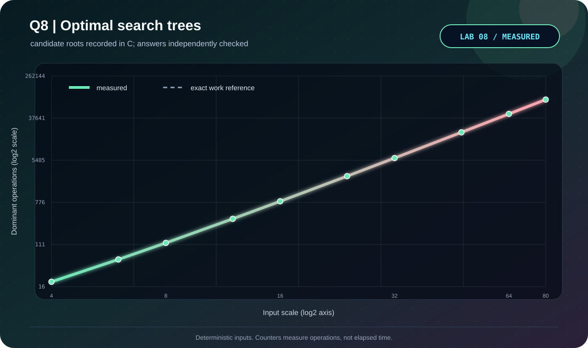

<p align="center"></p>

# Q8 · Optimal binary search trees

[← Lab 08](../README.md) · [Official question sheet](../Problem-Sheet-Lab-08.pdf) · [← Q7](../Q-7/README.md) · [Q9 →](../Q-9/README.md)

**SEARCH WITH INTENT** · `Theta(n^3) time / Theta(n^2) space`

## Input and required output

`n`, then `n` sorted keys, `n` successful-search probabilities p, and `n+1` failed-search probabilities q.

`0 <= n <= 200`; distinct increasing `int64_t` keys; finite nonnegative probabilities summing to 1 within 1e-8.

Dummy leaves are included in the expected cost: `sum p_i(depth(k_i)+1) + sum q_i(depth(d_i)+1)`. For a convention that counts only key comparisons on failed searches, subtract `sum q_i` from this reported cost. All-zero or unnormalized probabilities are rejected.

## State and transition

Use half-open key intervals [i,j). Empty intervals contain dummy d_i and have cost q_i.

`e[i,j] = min(e[i,k] + e[k+1,j] + w[i,j])`, where w is the total p/q weight of the interval.

## Why it works

Choosing root k partitions the sorted keys into independent ordered subtrees. Every key and dummy in them moves down one level, adding the interval weight. Trying every root therefore covers every valid BST. Short intervals precede longer ones.

## Reconstruction and output

Store the minimizing root for every interval and recursively print both subtrees, including all n+1 dummy leaves. `k1...kn` map to the submitted sorted keys.

## Complexity derivation

There are Theta(n^2) intervals and up to n candidate roots each: exactly n(n+1)(n+2)/6 root trials. Cost, weight, and root tables use Theta(n^2) space. This is the standard cubic DP; no Knuth optimization is claimed.

## Run the C solution

From this question folder:

```bash
gcc -std=c17 -O2 -Wall -Wextra -Wpedantic -Werror q8_optimal_binary_search_tree.c -lm -o q8
./q8 < q8_sample_input.txt
./q8 --json < q8_sample_input.txt  # result, counters, and state trace
```

In PowerShell, after running `python tools/build.py` from `lab8`:

```powershell
Get-Content q8_sample_input.txt | ..\bin\q8_optimal_binary_search_tree.exe
```

### Sample input

```text
5
10 20 30 40 50
0.15 0.10 0.05 0.10 0.20
0.05 0.10 0.05 0.05 0.05 0.10
```

### Captured answer

```text
Minimum expected cost (dummy-leaf depths included): 2.7500000000
Tree: (k2 (k1 d0 d1) (k5 (k4 (k3 d2 d3) d4) d5))
Key mapping: k1=10 k2=20 k3=30 k4=40 k5=50
Candidate roots: 35
```

## Independent validation

Enumerate every BST shape for n<=6, compare against a recursive interval oracle, and independently sum probability times depth on the reconstructed tree.

The shared [validator](../tools/validate.py) also checks malformed inputs and exact operation counters. See the [verification report](../VERIFICATION.md).

## Measured evidence

<p align="center"></p>

Measured primitive: **candidate roots**. The [dataset](q8_experimental_data.dat) comes from C counters after its answer passes the independent oracle. Axes show actual values on logarithmic scales; these are operation counts, not timings.

The dashed reference is the exact work count derived above; overlapping curves confirm the instrumented count.

The GIF illustrates the checked [C sample trace](q8_sample_trace.json). Use the [static frame](q8_walkthrough.png) if you prefer a still image.

## Files

| Artifact | Purpose |
|---|---|
| [q8_optimal_binary_search_tree.c](q8_optimal_binary_search_tree.c) | C17 solution, readable output and JSON trace |
| [Sample input](q8_sample_input.txt) · [sample output](q8_sample_output.txt) | Reproducible demonstration |
| [Measured data](q8_experimental_data.dat) · [experiment transcript](q8_experiment_output.txt) | Oracle-checked scaling trials |
| [C plotter](q8_plot_evidence.c) · [SVG chart](q8_evidence.svg) | Regenerate visual evidence without Gnuplot |
| [GIF walkthrough](q8_walkthrough.gif) · [static frame](q8_walkthrough.png) | Algorithm story |

[← Q7](../Q-7/README.md) · [Lab 08 dashboard](../README.md) · [Q9 →](../Q-9/README.md)
