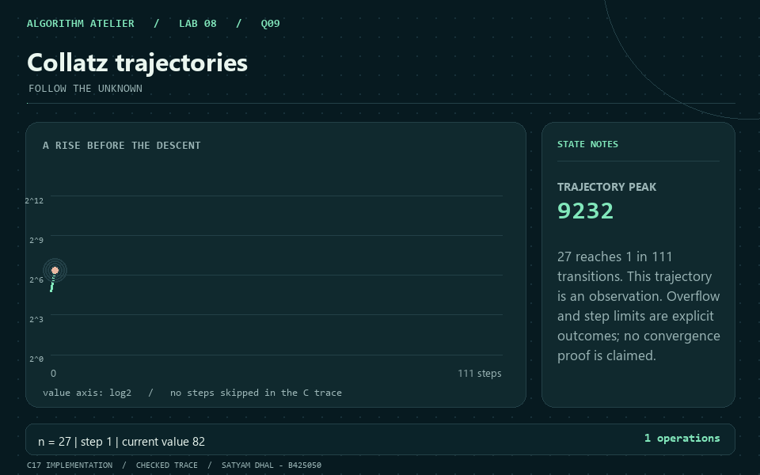
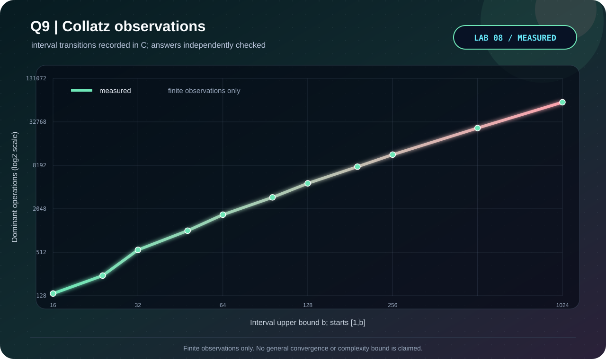

<p align="center"></p>

# Q9 · Collatz trajectories

[← Lab 08](../README.md) · [Official question sheet](../Problem-Sheet-Lab-08.pdf) · [← Q8](../Q-8/README.md) · [Main repository →](../../README.md)

**FOLLOW THE UNKNOWN** · `O(s + sum t(x)) time / O(s + r) space`

## Input and required output

Four unsigned decimal values: `start a b step_cap`.

`start >= 1`, `1 <= a <= b`; at most 10000 interval starts; `1 <= step_cap <= 1000000`; values fit `uint64_t`.

Each trajectory ends with `reached_1`, `overflow`, or `step_limit`. A capped/overflowing path is not reported as a counterexample. Intervals are inclusive. The champion considers completed paths only; ties prefer the first start.

## State and transition

For a positive start, keep current value, transitions, peak, and an explicit stop status.

`next = n/2` for even n, otherwise `3n+1`; stop on 1, unsafe arithmetic, or the configured transition limit.

## Why it works

This is a guarded arithmetic simulation, not an optimization DP. Check `n <= (UINT64_MAX-1)/3` before an odd transition. The program never substitutes wrapped arithmetic for the requested trajectory.

## Reconstruction and output

The single trajectory is retained in a dynamically grown array. Interval trajectories retain statistics only. Peak includes the starting value; transition count excludes it.

## Complexity derivation

For s transitions of the displayed path and r interval starts, time is O(s + sum t(x)) and storage O(s+r), with O(1) arithmetic under uint64_t. Each run is capped; no general bound on uncapped stopping time or universal convergence is asserted.

## Run the C solution

From this question folder:

```bash
gcc -std=c17 -O2 -Wall -Wextra -Wpedantic -Werror q9_collatz_analyser.c -lm -o q9
./q9 < q9_sample_input.txt
./q9 --json < q9_sample_input.txt  # result, counters, and state trace
```

In PowerShell, after running `python tools/build.py` from `lab8`:

```powershell
Get-Content q9_sample_input.txt | ..\bin\q9_collatz_analyser.exe
```

### Sample input

```text
27 1 100 10000
```

### Captured answer

```text
Start: 27
Status: reached_1
Transitions: 111
Peak: 9232
Trajectory: see the complete captured output.
Interval [1,100]: all 100 starts reached 1 within the configured cap.
```

## Independent validation

Arbitrary-precision Python trajectories independently enforce the C numeric boundary and check every interval record and stop status.

The shared [validator](../tools/validate.py) also checks malformed inputs and exact operation counters. See the [verification report](../VERIFICATION.md).

## Measured evidence

<p align="center"></p>

Measured primitive: **interval transitions**. The [dataset](q9_experimental_data.dat) comes from C counters after its answer passes the independent oracle. Axes show actual values on logarithmic scales; these are operation counts, not timings.

The chart contains finite interval observations only, with no asymptotic reference or convergence claim.

The GIF illustrates the checked [C sample trace](q9_sample_trace.json). Use the [static frame](q9_walkthrough.png) if you prefer a still image.

## Files

| Artifact | Purpose |
|---|---|
| [q9_collatz_analyser.c](q9_collatz_analyser.c) | C17 solution, readable output and JSON trace |
| [Sample input](q9_sample_input.txt) · [sample output](q9_sample_output.txt) | Reproducible demonstration |
| [Measured data](q9_experimental_data.dat) · [experiment transcript](q9_experiment_output.txt) | Oracle-checked scaling trials |
| [C plotter](q9_plot_evidence.c) · [SVG chart](q9_evidence.svg) | Regenerate visual evidence without Gnuplot |
| [GIF walkthrough](q9_walkthrough.gif) · [static frame](q9_walkthrough.png) | Algorithm story |

[← Q8](../Q-8/README.md) · [Lab 08 dashboard](../README.md) · [Main repository →](../../README.md)
