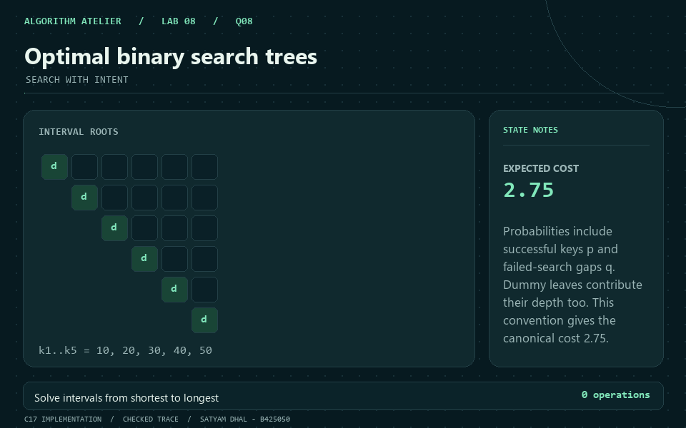

<p align="center"></p>
<p align="center"></p>

<h1 align="center">DAA Laboratory · Lab 08</h1>
<p align="center"><strong>Every state has a story.</strong><br>Optimize a value. Recover a witness. Follow a trajectory.</p>
<p align="center">Satyam Dhal · B425050 · CSE · IIIT Bhubaneswar<br>Instructor: Dr. Ajaya Kumar Dash · 29 September 2026</p>
<p align="center"><a href="../README.md">← Course index</a> · <a href="../lab7/README.md">Lab 07</a> · <a href="Problem-Sheet-Lab-08.pdf">Official problem sheet</a> · <a href="INPUTS.md">Input guide</a> · <a href="VERIFICATION.md">Verification</a></p>
<p align="center"></p>

## Laboratory dashboard

All nine questions retain the handout's numbering. Q1–Q8 use dynamic programming; Q9 is the separately stated Collatz assignment. The source is preserved as [Problem-Sheet-Lab-08.pdf](Problem-Sheet-Lab-08.pdf).

| Q | Problem | Recovered result | Time / space |
|:---:|---|---|---|
| **[1](Q-1/README.md)** | Minimum coin change | 2 coins: 3 + 3 | `Theta(cV) time / Theta(V) space` |
| **[2](Q-2/README.md)** | Count coin combinations | 10 unordered combinations | `O(cV) time / Theta(V) space` |
| **[3](Q-3/README.md)** | Longest common subsequence | Length 4: BCBA | `Theta(mn) time / Theta(mn) space` |
| **[4](Q-4/README.md)** | Longest increasing subsequence | Length 4: 2, 5, 7, 101 | `Theta(n^2) time / Theta(n) space` |
| **[5](Q-5/README.md)** | Maximum sum increasing subsequence | Sum 106: 1, 2, 3, 100 | `Theta(n^2) time / Theta(n) space` |
| **[6](Q-6/README.md)** | Edit distance & traceback | 3 edits, forward script | `Theta(mn) time / Theta(mn) space` |
| **[7](Q-7/README.md)** | Rod cutting & reconstruction | Revenue 22: 2 + 6 inches | `Theta(n^2) time / Theta(n) space` |
| **[8](Q-8/README.md)** | Optimal binary search trees | Expected cost 2.75, full key/dummy tree | `Theta(n^3) time / Theta(n^2) space` |
| **[9](Q-9/README.md)** | Collatz trajectories | 27: 111 transitions, peak 9232 | `O(s + sum t(x)) time / O(s + r) space` |

The coin bounds are pseudo-polynomial in the numeric target V. String bounds include boundary initialization for empty inputs. Q9 uses s displayed transitions and r interval starts; t(x) is the observed capped work for one interval trajectory.

## Nine visual stories

Each animation shows an actual checked sample answer. Mint marks solved states, peach marks selected choices, and the operation counter follows the algorithm's dominant work. Static PNGs are included beside every GIF.

<table>
<tr>
<td width="50%" align="center" valign="top"><h3>Q1 · Minimum coin change</h3><a href="Q-1/README.md"></a><p><sub>2 coins: 3 + 3</sub></p></td>
<td width="50%" align="center" valign="top"><h3>Q2 · Count coin combinations</h3><a href="Q-2/README.md"></a><p><sub>10 unordered combinations</sub></p></td>
</tr>
<tr>
<td width="50%" align="center" valign="top"><h3>Q3 · Longest common subsequence</h3><a href="Q-3/README.md"></a><p><sub>Length 4: BCBA</sub></p></td>
<td width="50%" align="center" valign="top"><h3>Q4 · Longest increasing subsequence</h3><a href="Q-4/README.md"></a><p><sub>Length 4: 2, 5, 7, 101</sub></p></td>
</tr>
<tr>
<td width="50%" align="center" valign="top"><h3>Q5 · Maximum sum increasing subsequence</h3><a href="Q-5/README.md"></a><p><sub>Sum 106: 1, 2, 3, 100</sub></p></td>
<td width="50%" align="center" valign="top"><h3>Q6 · Edit distance & traceback</h3><a href="Q-6/README.md"></a><p><sub>3 edits, forward script</sub></p></td>
</tr>
<tr>
<td width="50%" align="center" valign="top"><h3>Q7 · Rod cutting & reconstruction</h3><a href="Q-7/README.md"></a><p><sub>Revenue 22: 2 + 6 inches</sub></p></td>
<td width="50%" align="center" valign="top"><h3>Q8 · Optimal binary search trees</h3><a href="Q-8/README.md"></a><p><sub>Expected cost 2.75, full key/dummy tree</sub></p></td>
</tr>
<tr>
<td width="50%" align="center" valign="top" colspan="2"><h3>Q9 · Collatz trajectories</h3><a href="Q-9/README.md"></a><p><sub>27: 111 transitions, peak 9232</sub></p></td>
</tr>
</table>

## What the states remember

| Pattern | Questions | Why it helps |
|---|---|---|
| Amount and length prefixes | Q1, Q2, Q7 | A legal final coin or first piece reduces the remaining problem |
| Endpoint and pair-of-prefix states | Q3–Q6 | Input order constrains each predecessor or alignment action |
| Ordered intervals | Q8 | A root divides the search keys into independent ordered subtrees |
| Guarded trajectory simulation | Q9 | Explicit arithmetic and stopping rules make finite observations reproducible |

The parent, first-cut, and root choices make the optimum explainable. Counting combinations requires the coin loop outside the amount loop. Optimal BST cost includes dummy search leaves. Collatz observations include overflow and step-limit status; they make no universal termination claim.

## Measured work, independently checked

Each question includes a C solution, a separate C SVG plotter, a captured sample, JSON state trace, measured dataset, experiment transcript, complexity derivation, GIF, and PNG. The plots measure coin candidates, DP additions, prefix pairs, predecessor pairs, cut choices, root choices, or arithmetic transitions.

**18/18 strict C17 sources and 993 oracle-checked program executions passed locally.** The [verification report](VERIFICATION.md) identifies the independent oracle for each problem. The [CI workflow](../.github/workflows/lab8.yml) repeats the checks with GCC and Clang plus memory/undefined-behavior sanitizers on Linux; remote CI has not been run here.

## Build and explore

Portable build and checks (Python 3.9+ and GCC/Clang):

```bash
cd lab8
python tools/build.py
python tools/validate.py
```

Linux / macOS / MSYS2:

```bash
make all
make evidence
./bin/Q-1/q1_minimum_coin_change < Q-1/q1_sample_input.txt
```

Windows PowerShell:

```powershell
.\build_windows.bat
Get-Content Q-1/q1_sample_input.txt | .\bin\q1_minimum_coin_change.exe
```

To regenerate the artwork, install Pillow and run `python tools/generate_visuals.py`. C plotting needs no Gnuplot. The GIFs, SVG charts, explanations, and captured results display directly in the repository's READMEs; no separate page or app is needed.

## Repository map

```text
lab8/
├── README.md + INPUTS.md + VERIFICATION.md
├── Problem-Sheet-Lab-08.pdf
├── Makefile + build_windows.bat
├── common/                       C input, arithmetic, JSON, SVG helpers
├── tools/                        build, independent validation, artwork
├── assets/                       animated banner, divider, gallery
└── Q-1/ ... Q-9/                C + proof + checked evidence + animation
```

<p align="center"></p>
<p align="center"><strong>Choose a state. Solve its dependencies. Remember the choice.</strong></p>
<p align="center"><a href="../lab7/README.md">← Lab 07</a> · <a href="../README.md">Back to the course</a></p>
