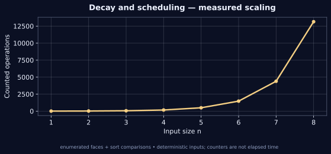

[← Lab 09](../README.md) · [Repository](../../README.md) · [Next question](../Q-2/README.md)

# Q01 · Fractional Knapsack with Deterioration Rate


**Decay and scheduling** · C17 · deterministic sample · independent oracle

## Problem

Given base values, weights and positive decay rates, choose a consumption order and fractions within capacity W to maximise total effective value. Density at time t is v/w - lambda*t.

## Input contract

`n W`, followed by n rows `value weight decay_rate`. n = 1..8; W and value = 0..10000; weight and rate = 0.001..10000. Real numbers are allowed.

Malformed, missing, out-of-range and trailing non-whitespace input is rejected with an error and nonzero exit status. [Full input guide](../INPUTS.md).

## Algorithm and modelling

The sheet does not specify how consumption advances time. This implementation explicitly assumes continuous consumption at one weight unit per time unit, starting at t=0 with no idle time. An amount x consumed from time s contributes (v/w)*x - lambda*x*(s+x/2). Items may be skipped, and unused capacity is allowed. For fixed amounts, put larger decay rates first. Optimise the amounts jointly by enumerating the faces of a bounded concave quadratic programme, rather than asserting that a density sort solves the fractional-choice problem.

## Why it works

For fixed x_i and x_j, swapping adjacent i,j changes value by (lambda_i-lambda_j)*x_i*x_j, so descending lambda is optimal. In this order the objective is rho^T x - (1/2)x^T H x with H_ij=min(lambda_i,lambda_j). H is positive semidefinite because min(a,b)=integral 1[t<=a]1[t<=b] dt. Thus the objective is concave. Enumerating zero, upper-bound and free coordinates, with capacity either slack or active, includes an optimal face. A singular free system can be moved to a boundary without changing the objective, so an optimum is represented by a nonsingular subface. The floating-point solver checks feasibility with tolerances; a separate gradient-based global optimality gap validates test cases.

## Complexity

There are at most 2*3^n face/capacity cases, each requiring an O(n^3) linear solve and feasibility check. Time is O(3^n n^3); workspace is O(n^2). The recorded work counts faces plus ordering comparisons, not all arithmetic operations. n<=8 is deliberate.

## Build and run

From the **repository root**, on Linux/macOS with GCC and Python 3:

```sh
python3 lab9/tools/build.py
lab9/bin/q1_deteriorating_knapsack < lab9/Q-1/q1_sample_input.txt
lab9/bin/q1_deteriorating_knapsack --json < lab9/Q-1/q1_sample_input.txt
```

On Windows PowerShell with GCC on PATH:

```powershell
py lab9/tools/build.py
Get-Content lab9/Q-1/q1_sample_input.txt | & .\lab9\bin\q1_deteriorating_knapsack.exe
```

For a single source, keep the shared `lab9/common/` directory:

```sh
gcc -std=c17 -O2 -Wall -Wextra -Wpedantic -Werror lab9/Q-1/q1_deteriorating_knapsack.c -lm -o q1
```

## Checked sample

Input:

```text
3 4
12 3 1
8 2 2
9 3 0.5
```

Actual output:

```text
Model: continuous consumption, 1 weight unit per time unit.
Item 1: amount 2.000000, fraction 0.666667, start 0.000000
Item 3: amount 2.000000, fraction 0.666667, start 2.000000
Maximum integrated value: 9.000000
Used capacity: 4.000000
Work: 57
```

The sample consumes two units of item 1 followed by two units of item 3, skips item 2 and obtains integrated value 9.000000 with used capacity 4.

[Input file](q1_sample_input.txt) · [Actual stdout](q1_sample_output.txt) · [Machine-readable result](q1_sample_trace.json)

## Measured evidence



The graph uses [actual counters](q1_data.dat) from deterministic C executions. The counted event is **enumerated faces + sort comparisons**. Counts describe this input family and the selected events; they do not establish a worst-case bound or represent wall-clock timings. Full inputs, C results and oracle status are retained in [scaling evidence](../scaling_evidence.json).

Run `python3 lab9/tools/validate.py` and `python3 lab9/tools/generate_evidence.py` from the repository root to reproduce the 805 core checks and 80 scaling checks. [Verification details](../VERIFICATION.md).

## Conclusion

The sample consumes two units of item 1 followed by two units of item 3, skips item 2 and obtains integrated value 9.000000 with used capacity 4. There are at most 2*3^n face/capacity cases, each requiring an O(n^3) linear solve and feasibility check. Time is O(3^n n^3); workspace is O(n^2). The recorded work counts faces plus ordering comparisons, not all arithmetic operations. n<=8 is deliberate.
