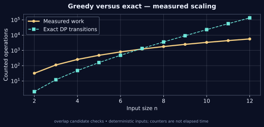

[← Lab 09](../README.md) · [Repository](../../README.md) · [Previous question](../Q-9/README.md)

# Q10 · Greedy Superstring Conjecture


**Greedy versus exact** · C17 · deterministic sample · independent oracle

## Problem

Explore shortest common superstrings and the maximum-overlap greedy heuristic. Compare its result with an exact optimum on small inputs; discuss the supplied conjecture claim carefully.

## Input contract

`n`, followed by n nonempty lowercase ASCII words, each 1..64 characters. n = 1..12. Duplicate and contained words are removed before either algorithm.

Malformed, missing, out-of-range and trailing non-whitespace input is rejected with an error and nonzero exit status. [Full input guide](../INPUTS.md).

## Algorithm and modelling

Repeatedly merge the directed pair with maximum suffix-prefix overlap; ties choose the first pair in current order. Separately solve subset DP: dp[mask][last] is the shortest superstring length covering mask and ending in last. Reconstruct both strings, verify every original input is contained, and report the observed ratio. The exact comparator is intentionally limited to twelve words.

## Why it works

After removing contained words, an optimal superstring can be represented by an ordering of the remaining words with maximum suffix-prefix overlaps. The subset recurrence tries every possible predecessor, so it obtains the optimum for the finite instance. Maximum-overlap greedy restricts this choice and is a heuristic. A sample ratio and small exhaustive checks provide instance evidence, not a universal approximation theorem.

## Complexity

Let L be the maximum intermediate string length, at most n*l for maximum input length l. The naive overlap routine costs O(L^2); O(n^3) directed-pair checks give a safe greedy bound O(n^3 L^2). Exact DP costs O(2^n n^2+n^2 l^2) time and O(2^n n+n^2+nL) space including strings. The work counter combines greedy overlap probes and exact-overlap precomputation; exact DP transitions are counted separately.

## Build and run

From the **repository root**, on Linux/macOS with GCC and Python 3:

```sh
python3 lab9/tools/build.py
lab9/bin/q10_greedy_superstring < lab9/Q-10/q10_sample_input.txt
lab9/bin/q10_greedy_superstring --json < lab9/Q-10/q10_sample_input.txt
```

On Windows PowerShell with GCC on PATH:

```powershell
py lab9/tools/build.py
Get-Content lab9/Q-10/q10_sample_input.txt | & .\lab9\bin\q10_greedy_superstring.exe
```

For a single source, keep the shared `lab9/common/` directory:

```sh
gcc -std=c17 -O2 -Wall -Wextra -Wpedantic -Werror lab9/Q-10/q10_greedy_superstring.c -lm -o q10
```

## Checked sample

Input:

```text
3
abb
bba
bbc
```

Actual output:

```text
Greedy superstring: abbabbc
Exact superstring: bbabbc
Greedy length: 7
Optimal length: 6
Observed ratio: 1.166667
Greedy is a heuristic; this is a finite-instance comparison.
Overlap checks: 38
Exact DP transitions: 12
```

On abb, bba and bbc, deterministic greedy gives abbabbc of length 7, while exact DP returns bbabbc of length 6. The observed ratio is 7/6; this example shows non-optimality, not a disproof of a 2-approximation bound.

[Input file](q10_sample_input.txt) · [Actual stdout](q10_sample_output.txt) · [Machine-readable result](q10_sample_trace.json)

## Measured evidence



The graph uses [actual counters](q10_data.dat) from deterministic C executions. The counted event is **overlap candidate checks**. Counts describe this input family and the selected events; they do not establish a worst-case bound or represent wall-clock timings. Full inputs, C results and oracle status are retained in [scaling evidence](../scaling_evidence.json).

Run `python3 lab9/tools/validate.py` and `python3 lab9/tools/generate_evidence.py` from the repository root to reproduce the 805 core checks and 80 scaling checks. [Verification details](../VERIFICATION.md).

## Conclusion

On abb, bba and bbc, deterministic greedy gives abbabbc of length 7, while exact DP returns bbabbc of length 6. The observed ratio is 7/6; this example shows non-optimality, not a disproof of a 2-approximation bound. Let L be the maximum intermediate string length, at most n*l for maximum input length l. The naive overlap routine costs O(L^2); O(n^3) directed-pair checks give a safe greedy bound O(n^3 L^2). Exact DP costs O(2^n n^2+n^2 l^2) time and O(2^n n+n^2+nL) space including strings. The work counter combines greedy overlap probes and exact-overlap precomputation; exact DP transitions are counted separately.

## Conjecture context

The sheet cites [Hiroki Shibata's September 2026 preprint](https://arxiv.org/abs/2609.01365). Its version 1 reports a counterexample family whose ratio approaches 9/4. The sheet also says the claim has not been officially validated. This lab does not independently certify the preprint, and no universal 2-approximation guarantee is assumed. The exact comparator certifies only the supplied finite instances.
