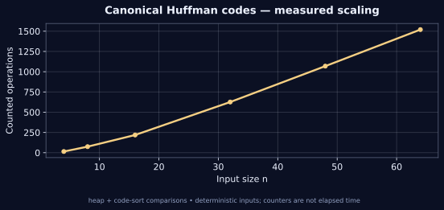

[← Lab 09](../README.md) · [Repository](../../README.md) · [Previous question](../Q-1/README.md) · [Next question](../Q-3/README.md)

# Q02 · Huffman Coding


**Canonical Huffman codes** · C17 · deterministic sample · independent oracle

## Problem

Given symbol frequencies, construct a prefix-free binary code with minimum expected length and output a canonical Huffman codebook ordered by length, then symbol.

## Input contract

`n`, followed by n rows `symbol frequency`. Symbols are distinct printable non-space ASCII except double quote and backslash; frequencies = 1..10^9. There are 92 supported symbols. Omit zero-frequency symbols.

Malformed, missing, out-of-range and trailing non-whitespace input is rejected with an error and nonzero exit status. [Full input guide](../INPUTS.md).

## Algorithm and modelling

Put all positive frequencies in a min-heap. Repeatedly merge the two lightest nodes, then traverse the tree to obtain code lengths. Sort symbols by (length, ASCII symbol), increment the previous code and shift when the length increases. The printed codebook is canonical; singleton input uses the one-bit code 0.

## Why it works

In an optimal prefix tree, the two least frequent symbols can be assigned deepest sibling leaves by exchange. Contracting them reduces the same optimisation problem to one fewer leaf, proving the repeated minimum-pair merge. Canonicalisation preserves every length and hence the weighted cost; the generated codes are checked for the prefix-free property.

## Complexity

Heap construction by insertion and n-1 merges take O(n log n). Ordering the codebook takes O(n log n); writing B total code bits takes O(B). Time is O(n log n+B), space O(n+B). A maximally skewed codebook can have B=Theta(n^2).

## Build and run

From the **repository root**, on Linux/macOS with GCC and Python 3:

```sh
python3 lab9/tools/build.py
lab9/bin/q2_huffman_coding < lab9/Q-2/q2_sample_input.txt
lab9/bin/q2_huffman_coding --json < lab9/Q-2/q2_sample_input.txt
```

On Windows PowerShell with GCC on PATH:

```powershell
py lab9/tools/build.py
Get-Content lab9/Q-2/q2_sample_input.txt | & .\lab9\bin\q2_huffman_coding.exe
```

For a single source, keep the shared `lab9/common/` directory:

```sh
gcc -std=c17 -O2 -Wall -Wextra -Wpedantic -Werror lab9/Q-2/q2_huffman_coding.c -lm -o q2
```

## Checked sample

Input:

```text
6
A 45
B 13
C 12
D 16
E 9
F 5
```

Actual output:

```text
Canonical codebook (length, then symbol):
A: 0 (1 bits)
B: 100 (3 bits)
C: 101 (3 bits)
D: 110 (3 bits)
E: 1110 (4 bits)
F: 1111 (4 bits)
Weighted bits: 224
Average bits: 2.240000
Work: 42
```

The sample codebook has weighted cost 224 bits and mean length 2.24 bits per symbol. The lengths and canonical bit strings agree with an independent optimum.

[Input file](q2_sample_input.txt) · [Actual stdout](q2_sample_output.txt) · [Machine-readable result](q2_sample_trace.json)

## Measured evidence



The graph uses [actual counters](q2_data.dat) from deterministic C executions. The counted event is **heap + code-sort comparisons**. Counts describe this input family and the selected events; they do not establish a worst-case bound or represent wall-clock timings. Full inputs, C results and oracle status are retained in [scaling evidence](../scaling_evidence.json).

Run `python3 lab9/tools/validate.py` and `python3 lab9/tools/generate_evidence.py` from the repository root to reproduce the 805 core checks and 80 scaling checks. [Verification details](../VERIFICATION.md).

## Conclusion

The sample codebook has weighted cost 224 bits and mean length 2.24 bits per symbol. The lengths and canonical bit strings agree with an independent optimum. Heap construction by insertion and n-1 merges take O(n log n). Ordering the codebook takes O(n log n); writing B total code bits takes O(B). Time is O(n log n+B), space O(n+B). A maximally skewed codebook can have B=Theta(n^2).
