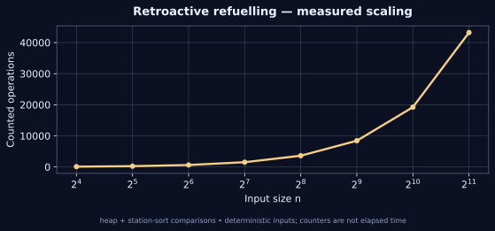

[← Lab 09](../README.md) · [Repository](../../README.md) · [Previous question](../Q-2/README.md) · [Next question](../Q-4/README.md)

# Q03 · Minimum Initial Fuel (Reverse Greedy)


**Retroactive refuelling** · C17 · deterministic sample · independent oracle

## Problem

Reach target distance D starting with fuel F. Station (d, f) gives f additional fuel at distance d. Find the minimum number of refuelling stops, or report impossibility.

## Input contract

`n D F`, followed by n rows `distance fuel`. n = 0..100000; D, F and fuel = 0..10^9; station distance = 0..D. Stations may be unsorted. One fuel unit covers one distance unit; tank capacity is unlimited.

Malformed, missing, out-of-range and trailing non-whitespace input is rejected with an error and nonzero exit status. [Full input guide](../INPUTS.md).

## Algorithm and modelling

Sort stations by distance. Keep every reachable, unused station in a max-heap keyed by fuel. When current reach is below D, take the largest available fuel; if the heap is empty, the journey is impossible. Selections are retrospective bookkeeping, and are finally reported in valid travel order. The paper title is retained exactly, but its body asks for minimum stops with fixed starting fuel, which is the task solved here.

## Why it works

Whenever extra fuel is required, any feasible continuation must have chosen some already reachable station. Replacing that choice by the available station with maximum fuel cannot reduce reachable distance and uses the same number of stops. Apply this exchange repeatedly. An empty available heap before reaching D is an impossibility certificate. Selected station IDs are replayed in physical travel order.

## Complexity

Station sorting and at most n heap insertions/removals give O(n log n) time and O(n) space. The counter includes sort and heap comparisons.

## Build and run

From the **repository root**, on Linux/macOS with GCC and Python 3:

```sh
python3 lab9/tools/build.py
lab9/bin/q3_minimum_refuelling_stops < lab9/Q-3/q3_sample_input.txt
lab9/bin/q3_minimum_refuelling_stops --json < lab9/Q-3/q3_sample_input.txt
```

On Windows PowerShell with GCC on PATH:

```powershell
py lab9/tools/build.py
Get-Content lab9/Q-3/q3_sample_input.txt | & .\lab9\bin\q3_minimum_refuelling_stops.exe
```

For a single source, keep the shared `lab9/common/` directory:

```sh
gcc -std=c17 -O2 -Wall -Wextra -Wpedantic -Werror lab9/Q-3/q3_minimum_refuelling_stops.c -lm -o q3
```

## Checked sample

Input:

```text
4 100 10
10 60
20 30
30 30
60 40
```

Actual output:

```text
Minimum refuelling stops: 2
Travel-order station IDs: [1,4]
Reachable distance: 110
Work: 9
```

The sample reaches distance 110 using two stops, stations 1 and 4 in travel order. The body of the question is answered with fixed initial fuel 10.

[Input file](q3_sample_input.txt) · [Actual stdout](q3_sample_output.txt) · [Machine-readable result](q3_sample_trace.json)

## Measured evidence



The graph uses [actual counters](q3_data.dat) from deterministic C executions. The counted event is **heap + station-sort comparisons**. Counts describe this input family and the selected events; they do not establish a worst-case bound or represent wall-clock timings. Full inputs, C results and oracle status are retained in [scaling evidence](../scaling_evidence.json).

Run `python3 lab9/tools/validate.py` and `python3 lab9/tools/generate_evidence.py` from the repository root to reproduce the 805 core checks and 80 scaling checks. [Verification details](../VERIFICATION.md).

## Conclusion

The sample reaches distance 110 using two stops, stations 1 and 4 in travel order. The body of the question is answered with fixed initial fuel 10. Station sorting and at most n heap insertions/removals give O(n log n) time and O(n) space. The counter includes sort and heap comparisons.
