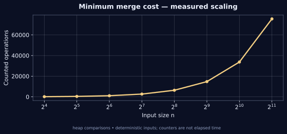

[← Lab 09](../README.md) · [Repository](../../README.md) · [Previous question](../Q-3/README.md) · [Next question](../Q-5/README.md)

# Q04 · Minimum Cost to Connect Sticks


**Minimum merge cost** · C17 · deterministic sample · independent oracle

## Problem

Connecting sticks of lengths x and y costs x+y and produces a stick of length x+y. Find the minimum total cost of connecting all sticks into one.

## Input contract

`n`, followed by n positive lengths. n = 0..100000; length = 1..10^9. An empty or singleton collection costs zero.

Malformed, missing, out-of-range and trailing non-whitespace input is rejected with an error and nonzero exit status. [Full input guide](../INPUTS.md).

## Algorithm and modelling

Put all lengths in a min-heap. Remove the two smallest, add their sum to the total, and return the new stick to the heap. Record each merge so the final cost can be replayed.

## Why it works

The two shortest sticks can occupy deepest sibling leaves of an optimal merge tree: placing smaller weights at larger depths cannot increase cost. Contract those siblings and solve the reduced instance. The resulting induction is the same minimum-pair argument as Huffman coding.

## Complexity

At most n-1 merges perform a constant number of O(log n) heap operations: O(n log n) time and O(n) space including the merge trace.

## Build and run

From the **repository root**, on Linux/macOS with GCC and Python 3:

```sh
python3 lab9/tools/build.py
lab9/bin/q4_connect_sticks < lab9/Q-4/q4_sample_input.txt
lab9/bin/q4_connect_sticks --json < lab9/Q-4/q4_sample_input.txt
```

On Windows PowerShell with GCC on PATH:

```powershell
py lab9/tools/build.py
Get-Content lab9/Q-4/q4_sample_input.txt | & .\lab9\bin\q4_connect_sticks.exe
```

For a single source, keep the shared `lab9/common/` directory:

```sh
gcc -std=c17 -O2 -Wall -Wextra -Wpedantic -Werror lab9/Q-4/q4_connect_sticks.c -lm -o q4
```

## Checked sample

Input:

```text
5
4 3 2 6 7
```

Actual output:

```text
Merge 1: 2 + 3 = 5
Merge 2: 4 + 5 = 9
Merge 3: 6 + 7 = 13
Merge 4: 9 + 13 = 22
Minimum total cost: 49
Work: 16
```

The sample merges 2+3, 4+5, 6+7 and 9+13. Their costs sum to the minimum total 49.

[Input file](q4_sample_input.txt) · [Actual stdout](q4_sample_output.txt) · [Machine-readable result](q4_sample_trace.json)

## Measured evidence



The graph uses [actual counters](q4_data.dat) from deterministic C executions. The counted event is **heap comparisons**. Counts describe this input family and the selected events; they do not establish a worst-case bound or represent wall-clock timings. Full inputs, C results and oracle status are retained in [scaling evidence](../scaling_evidence.json).

Run `python3 lab9/tools/validate.py` and `python3 lab9/tools/generate_evidence.py` from the repository root to reproduce the 805 core checks and 80 scaling checks. [Verification details](../VERIFICATION.md).

## Conclusion

The sample merges 2+3, 4+5, 6+7 and 9+13. Their costs sum to the minimum total 49. At most n-1 merges perform a constant number of O(log n) heap operations: O(n log n) time and O(n) space including the merge trace.
