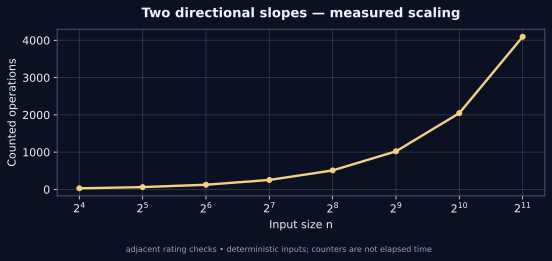

[← Lab 09](../README.md) · [Repository](../../README.md) · [Previous question](../Q-4/README.md) · [Next question](../Q-6/README.md)

# Q05 · Candy Distribution Problem (Bi-directional Slope Greedy)


**Two directional slopes** · C17 · deterministic sample · independent oracle

## Problem

Give each child at least one candy. A child with a higher rating than an immediate neighbour must receive more candies. Find the minimum total and an allocation.

## Input contract

`n`, followed by n ratings. n = 0..100000; ratings = -10^9..10^9. Equal ratings impose no extra constraint.

Malformed, missing, out-of-range and trailing non-whitespace input is rejected with an error and nonzero exit status. [Full input guide](../INPUTS.md).

## Algorithm and modelling

Initialise each allocation to one. A left-to-right pass enforces constraints from the left neighbour. A right-to-left pass takes the maximum of that allocation and the lower bound imposed by the right neighbour. Sum the resulting componentwise minimum allocation.

## Why it works

Every feasible allocation must be at least the ascending-run bound from the left and the descending-run bound from the right. Their pointwise maximum satisfies every neighbour constraint. It is therefore componentwise no greater than any feasible allocation and minimises the sum.

## Complexity

Two passes and a sum take Theta(n) time. The witness uses O(n) space. Exactly 2*max(n-1,0) neighbour comparisons are counted.

## Build and run

From the **repository root**, on Linux/macOS with GCC and Python 3:

```sh
python3 lab9/tools/build.py
lab9/bin/q5_candy_distribution < lab9/Q-5/q5_sample_input.txt
lab9/bin/q5_candy_distribution --json < lab9/Q-5/q5_sample_input.txt
```

On Windows PowerShell with GCC on PATH:

```powershell
py lab9/tools/build.py
Get-Content lab9/Q-5/q5_sample_input.txt | & .\lab9\bin\q5_candy_distribution.exe
```

For a single source, keep the shared `lab9/common/` directory:

```sh
gcc -std=c17 -O2 -Wall -Wextra -Wpedantic -Werror lab9/Q-5/q5_candy_distribution.c -lm -o q5
```

## Checked sample

Input:

```text
5
1 3 4 5 2
```

Actual output:

```text
Ratings: [1,3,4,5,2]
Candies: [1,2,3,4,1]
Minimum total candies: 11
Work: 8
```

Ratings [1,3,4,5,2] yield candies [1,2,3,4,1], whose minimum total is 11. Eight neighbour checks agree with 2(n-1).

[Input file](q5_sample_input.txt) · [Actual stdout](q5_sample_output.txt) · [Machine-readable result](q5_sample_trace.json)

## Measured evidence



The graph uses [actual counters](q5_data.dat) from deterministic C executions. The counted event is **adjacent rating checks**. Counts describe this input family and the selected events; they do not establish a worst-case bound or represent wall-clock timings. Full inputs, C results and oracle status are retained in [scaling evidence](../scaling_evidence.json).

Run `python3 lab9/tools/validate.py` and `python3 lab9/tools/generate_evidence.py` from the repository root to reproduce the 805 core checks and 80 scaling checks. [Verification details](../VERIFICATION.md).

## Conclusion

Ratings [1,3,4,5,2] yield candies [1,2,3,4,1], whose minimum total is 11. Eight neighbour checks agree with 2(n-1). Two passes and a sum take Theta(n) time. The witness uses O(n) space. Exactly 2*max(n-1,0) neighbour comparisons are counted.
