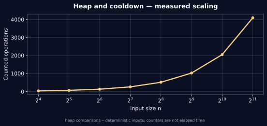

[← Lab 09](../README.md) · [Repository](../../README.md) · [Previous question](../Q-5/README.md) · [Next question](../Q-7/README.md)

# Q06 · Reorganise String with K-Distance Apart


**Heap and cooldown** · C17 · deterministic sample · independent oracle

## Problem

Rearrange a string so equal characters occur at positions at least K apart. Return an empty string when no rearrangement exists.

## Input contract

First line: lowercase ASCII string, possibly empty, up to 100000 characters. Second line: K = 0..100000. Positions are zero based; equality at exactly K is allowed.

Malformed, missing, out-of-range and trailing non-whitespace input is rejected with an error and nonzero exit status. [Full input guide](../INPUTS.md).

## Algorithm and modelling

Choose the remaining character with highest frequency among those currently available. After placing it at position p, keep it in a FIFO cooldown queue until p+K. Release ready characters before choosing the next position. If no character is available while work remains, report impossibility. Equal frequencies use ASCII order for deterministic output.

## Why it works

Equal characters cannot be reused before their release position. Among released types, using the most frequent remaining type protects the tightest future demand; the uniform-spacing exchange argument yields the standard maximum-frequency scheduling rule. The independent feasibility criterion is (maximum_count-1)*max(K,1)+number_of_maximum_types <= length. Every reported arrangement is also replayed to check its multiset and distances.

## Complexity

For m characters and sigma distinct types, heap scheduling takes O(m log sigma) time, conventionally O(m) for sigma=1, and O(m+sigma) space including input, output and the cooldown queue. Sigma<=26 in this implementation.

## Build and run

From the **repository root**, on Linux/macOS with GCC and Python 3:

```sh
python3 lab9/tools/build.py
lab9/bin/q6_reorganise_string < lab9/Q-6/q6_sample_input.txt
lab9/bin/q6_reorganise_string --json < lab9/Q-6/q6_sample_input.txt
```

On Windows PowerShell with GCC on PATH:

```powershell
py lab9/tools/build.py
Get-Content lab9/Q-6/q6_sample_input.txt | & .\lab9\bin\q6_reorganise_string.exe
```

For a single source, keep the shared `lab9/common/` directory:

```sh
gcc -std=c17 -O2 -Wall -Wextra -Wpedantic -Werror lab9/Q-6/q6_reorganise_string.c -lm -o q6
```

## Checked sample

Input:

```text
aaadbbcc
3
```

Actual output:

```text
K: 3
Reorganised string: abcabcad
Status: valid
Work: 10
```

For aaadbbcc and K=3 the sample produces abcabcad. Its character counts are unchanged and all equal-letter gaps satisfy the requirement.

[Input file](q6_sample_input.txt) · [Actual stdout](q6_sample_output.txt) · [Machine-readable result](q6_sample_trace.json)

## Measured evidence



The graph uses [actual counters](q6_data.dat) from deterministic C executions. The counted event is **heap comparisons**. Counts describe this input family and the selected events; they do not establish a worst-case bound or represent wall-clock timings. Full inputs, C results and oracle status are retained in [scaling evidence](../scaling_evidence.json).

Run `python3 lab9/tools/validate.py` and `python3 lab9/tools/generate_evidence.py` from the repository root to reproduce the 805 core checks and 80 scaling checks. [Verification details](../VERIFICATION.md).

## Conclusion

For aaadbbcc and K=3 the sample produces abcabcad. Its character counts are unchanged and all equal-letter gaps satisfy the requirement. For m characters and sigma distinct types, heap scheduling takes O(m log sigma) time, conventionally O(m) for sigma=1, and O(m+sigma) space including input, output and the cooldown queue. Sigma<=26 in this implementation.
