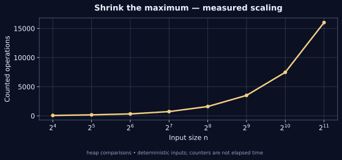

[← Lab 09](../README.md) · [Repository](../../README.md) · [Previous question](../Q-6/README.md) · [Next question](../Q-8/README.md)

# Q07 · Minimise Deviation in Array (Two-Way Greedy with Max-Heap)


**Shrink the maximum** · C17 · deterministic sample · independent oracle

## Problem

For positive integers, multiply an odd element by two or divide an even element by two any number of times. Minimise maximum minus minimum and return a legal witness.

## Input contract

`n`, followed by n positive values. n = 1..100000; values = 1..10^9. Arithmetic and totals use signed 64-bit integers.

Malformed, missing, out-of-range and trailing non-whitespace input is rejected with an error and nonzero exit status. [Full input guide](../INPUTS.md).

## Algorithm and modelling

Double odd values to put every element at its largest reachable even representative. Maintain a max-heap and the smallest current value. Record the current range, halve the maximum while it is even, and stop when the maximum is odd. Reconstruct a witness inside the best interval by halving each normalised original until it is no larger than the recorded upper bound.

## Why it works

Each element has a finite descending chain of reachable values from its normalised maximum to its odd base. Only decreasing a current maximum can shrink the upper endpoint; decreasing any other element cannot lower that maximum and may lower the minimum. Enumerating successive maximum reductions therefore examines a best range. Once the maximum is odd it cannot decrease further. The witness chooses a legal value from each chain inside the best recorded interval.

## Complexity

Each normalised value can be halved at most O(log M) times, for O(n log M) reductions, each using O(log n) heap work. Time is O(n log M log n) and space O(n), using log(n+1) for the singleton convention. Witness reconstruction costs O(n log M) without copying the whole array after every step.

## Build and run

From the **repository root**, on Linux/macOS with GCC and Python 3:

```sh
python3 lab9/tools/build.py
lab9/bin/q7_minimise_deviation < lab9/Q-7/q7_sample_input.txt
lab9/bin/q7_minimise_deviation --json < lab9/Q-7/q7_sample_input.txt
```

On Windows PowerShell with GCC on PATH:

```powershell
py lab9/tools/build.py
Get-Content lab9/Q-7/q7_sample_input.txt | & .\lab9\bin\q7_minimise_deviation.exe
```

For a single source, keep the shared `lab9/common/` directory:

```sh
gcc -std=c17 -O2 -Wall -Wextra -Wpedantic -Werror lab9/Q-7/q7_minimise_deviation.c -lm -o q7
```

## Checked sample

Input:

```text
5
4 1 5 20 3
```

Actual output:

```text
Minimum deviation: 3
Witness array: [4,2,5,5,3]
Best interval: [2,5]
Halvings: 4
Work: 22
```

The sample achieves minimum deviation 3 using the legal witness [4,2,5,5,3] in interval [2,5]. Four maximum halvings suffice.

[Input file](q7_sample_input.txt) · [Actual stdout](q7_sample_output.txt) · [Machine-readable result](q7_sample_trace.json)

## Measured evidence



The graph uses [actual counters](q7_data.dat) from deterministic C executions. The counted event is **heap comparisons**. Counts describe this input family and the selected events; they do not establish a worst-case bound or represent wall-clock timings. Full inputs, C results and oracle status are retained in [scaling evidence](../scaling_evidence.json).

Run `python3 lab9/tools/validate.py` and `python3 lab9/tools/generate_evidence.py` from the repository root to reproduce the 805 core checks and 80 scaling checks. [Verification details](../VERIFICATION.md).

## Conclusion

The sample achieves minimum deviation 3 using the legal witness [4,2,5,5,3] in interval [2,5]. Four maximum halvings suffice. Each normalised value can be halved at most O(log M) times, for O(n log M) reductions, each using O(log n) heap work. Time is O(n log M log n) and space O(n), using log(n+1) for the singleton convention. Witness reconstruction costs O(n log M) without copying the whole array after every step.
