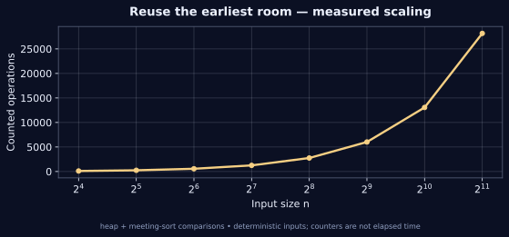

[← Lab 09](../README.md) · [Repository](../../README.md) · [Previous question](../Q-7/README.md) · [Next question](../Q-9/README.md)

# Q08 · Minimum Number of Meeting Rooms


**Reuse the earliest room** · C17 · deterministic sample · independent oracle

## Problem

Assign meetings to the minimum number of rooms. Meetings use half-open intervals [start,end); a room may be reused when its previous meeting ends.

## Input contract

`n`, followed by n rows `start end`. n = 0..100000; 0 <= start <= end <= 10^9. Zero-length intervals use room ID 0 and consume no room.

Malformed, missing, out-of-range and trailing non-whitespace input is rejected with an error and nonzero exit status. [Full input guide](../INPUTS.md).

## Algorithm and modelling

Process nonempty meetings in start order. A min-heap stores each allocated room with its current end time. Reuse the earliest-ending room if it has ended; otherwise allocate one new room. Preserve original input indices to return the complete assignment in input order.

## Why it works

If the earliest-ending allocated room has not ended, all allocated rooms overlap the new start, so one additional room is unavoidable. If it has ended, reuse requires no new room. Thus each allocation matches a simultaneous-overlap lower bound and the final count is minimum.

## Complexity

Sorting and heap assignment give O(n log n) time and O(n) space. The independent end-before-start sweep uses the same half-open convention.

## Build and run

From the **repository root**, on Linux/macOS with GCC and Python 3:

```sh
python3 lab9/tools/build.py
lab9/bin/q8_meeting_rooms < lab9/Q-8/q8_sample_input.txt
lab9/bin/q8_meeting_rooms --json < lab9/Q-8/q8_sample_input.txt
```

On Windows PowerShell with GCC on PATH:

```powershell
py lab9/tools/build.py
Get-Content lab9/Q-8/q8_sample_input.txt | & .\lab9\bin\q8_meeting_rooms.exe
```

For a single source, keep the shared `lab9/common/` directory:

```sh
gcc -std=c17 -O2 -Wall -Wextra -Wpedantic -Werror lab9/Q-8/q8_meeting_rooms.c -lm -o q8
```

## Checked sample

Input:

```text
6
0 30
5 10
15 20
20 30
30 40
8 12
```

Actual output:

```text
Minimum meeting rooms: 3
Room IDs in input order: [1,2,2,3,2,3]
Intervals: [start,end); zero length uses no room.
Work: 23
```

The six sample meetings need three rooms; IDs [1,2,2,3,2,3] give a conflict-free assignment. Reuse at a shared endpoint is allowed.

[Input file](q8_sample_input.txt) · [Actual stdout](q8_sample_output.txt) · [Machine-readable result](q8_sample_trace.json)

## Measured evidence



The graph uses [actual counters](q8_data.dat) from deterministic C executions. The counted event is **heap + meeting-sort comparisons**. Counts describe this input family and the selected events; they do not establish a worst-case bound or represent wall-clock timings. Full inputs, C results and oracle status are retained in [scaling evidence](../scaling_evidence.json).

Run `python3 lab9/tools/validate.py` and `python3 lab9/tools/generate_evidence.py` from the repository root to reproduce the 805 core checks and 80 scaling checks. [Verification details](../VERIFICATION.md).

## Conclusion

The six sample meetings need three rooms; IDs [1,2,2,3,2,3] give a conflict-free assignment. Reuse at a shared endpoint is allowed. Sorting and heap assignment give O(n log n) time and O(n) space. The independent end-before-start sweep uses the same half-open convention.
