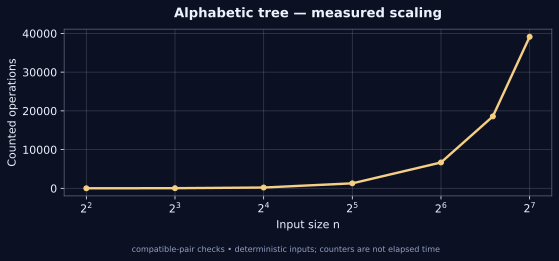

[← Lab 09](../README.md) · [Repository](../../README.md) · [Previous question](../Q-8/README.md) · [Next question](../Q-10/README.md)

# Q09 · Hu-Tucker Greedy Simulation


**Alphabetic tree** · C17 · deterministic sample · independent oracle

## Problem

Construct an optimal alphabetic leaf tree for ordered positive weights, preserving the in-order leaf sequence and minimising the sum of weight times leaf depth.

## Input contract

`n`, followed by n ordered positive weights. n = 1..256; weight = 1..10^9. Leaf order is fixed and weights belong to leaves, rather than internal search keys.

Malformed, missing, out-of-range and trailing non-whitespace input is rejected with an error and nonzero exit status. [Full input guide](../INPUTS.md).

## Algorithm and modelling

Use the genuine three-phase Hu-Tucker procedure. Two active nodes are compatible when no remaining original leaf lies strictly between them; artificial nodes do not block compatibility. Merge the minimum-sum compatible pair with a consistent leftmost tie rule. Compute each original leaf depth in the combination tree, then reconstruct an alphabetic tree from those depths using an ordered stack. Scanning all compatible pairs is a transparent simulation, not the fastest implementation.

## Why it works

Hu-Tucker compatible-pair contraction yields optimal alphabetic leaf depths, and its final reconstruction preserves those depths while restoring leaf order. The compatibility test is essential: merely choosing the smallest adjacent pair is a different, generally suboptimal algorithm. Independent interval DP computes OPT(i,j)=sum(weights[i..j])+min_k(OPT(i,k)+OPT(k+1,j)) and checks the simulation cost; ordered prefix codes and weighted depths are also replayed.

## Complexity

A direct scan considers at most O(k^2) compatible pairs at active size k. Summing for k=n..2 gives O(n^3) time. Tree, stack, codes and active nodes use O(n) workspace excluding emitted text. Emitting all code bits can take O(n^2), within the cubic time bound. n<=256 is the simulation limit.

## Build and run

From the **repository root**, on Linux/macOS with GCC and Python 3:

```sh
python3 lab9/tools/build.py
lab9/bin/q9_hu_tucker_simulation < lab9/Q-9/q9_sample_input.txt
lab9/bin/q9_hu_tucker_simulation --json < lab9/Q-9/q9_sample_input.txt
```

On Windows PowerShell with GCC on PATH:

```powershell
py lab9/tools/build.py
Get-Content lab9/Q-9/q9_sample_input.txt | & .\lab9\bin\q9_hu_tucker_simulation.exe
```

For a single source, keep the shared `lab9/common/` directory:

```sh
gcc -std=c17 -O2 -Wall -Wextra -Wpedantic -Werror lab9/Q-9/q9_hu_tucker_simulation.c -lm -o q9
```

## Checked sample

Input:

```text
8
1 2 23 4 3 3 5 19
```

Actual output:

```text
Optimal alphabetic cost: 153
Leaf 1: weight 1, depth 3, code 000
Leaf 2: weight 2, depth 3, code 001
Leaf 3: weight 23, depth 2, code 01
Leaf 4: weight 4, depth 4, code 1000
Leaf 5: weight 3, depth 4, code 1001
Leaf 6: weight 3, depth 4, code 1010
Leaf 7: weight 5, depth 4, code 1011
Leaf 8: weight 19, depth 2, code 11
Compatible-pair checks: 34
```

The sample has optimal alphabetic cost 153. Codes 000,001,01,1000,1001,1010,1011,11 preserve the input leaf order and replay the weighted cost.

[Input file](q9_sample_input.txt) · [Actual stdout](q9_sample_output.txt) · [Machine-readable result](q9_sample_trace.json)

## Measured evidence



The graph uses [actual counters](q9_data.dat) from deterministic C executions. The counted event is **compatible-pair checks**. Counts describe this input family and the selected events; they do not establish a worst-case bound or represent wall-clock timings. Full inputs, C results and oracle status are retained in [scaling evidence](../scaling_evidence.json).

Run `python3 lab9/tools/validate.py` and `python3 lab9/tools/generate_evidence.py` from the repository root to reproduce the 805 core checks and 80 scaling checks. [Verification details](../VERIFICATION.md).

## Conclusion

The sample has optimal alphabetic cost 153. Codes 000,001,01,1000,1001,1010,1011,11 preserve the input leaf order and replay the weighted cost. A direct scan considers at most O(k^2) compatible pairs at active size k. Summing for k=n..2 gives O(n^3) time. Tree, stack, codes and active nodes use O(n) workspace excluding emitted text. Emitting all code bits can take O(n^2), within the cubic time bound. n<=256 is the simulation limit.

## Primary references

[Hu and Tucker (1971)](https://epubs.siam.org/doi/10.1137/0121057) · [MIT notes on compatible merges and reconstruction](https://math.mit.edu/~djk/18.310/Lecture-Notes/PeterShor-hu-tucker.html)
