[← Repository](../README.md) · [Lab 07](../lab7/lab7/README.md) · [Lab 08](../lab8/README.md)

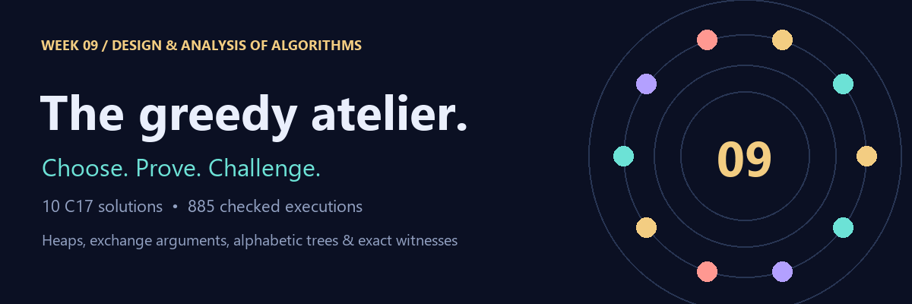

# Lab 09 · Greedy design

**06 October 2026 · Dr. Ajaya Kumar Dash · BTech CS-B / CE · Semester 3**

Ten problems examine when a local choice has a proof, when a heap makes that choice efficient, and when an exact comparator exposes a heuristic's limits. Every solution includes checked output, a reconstructed answer, measured data and an original animation that renders directly on GitHub.

  

## Question map

| Q | Exact paper title | Implementation bound |
|:--:|---|---|
| [01](Q-1/README.md) | Fractional Knapsack with Deterioration Rate | O(3^n n^3) time; O(n^2) workspace; n <= 8 |
| [02](Q-2/README.md) | Huffman Coding | O(n log n + B) time; O(n + B) space |
| [03](Q-3/README.md) | Minimum Initial Fuel (Reverse Greedy) | O(n log n) time; O(n) space |
| [04](Q-4/README.md) | Minimum Cost to Connect Sticks | O(n log n) time; O(n) space |
| [05](Q-5/README.md) | Candy Distribution Problem (Bi-directional Slope Greedy) | Theta(n) time; O(n) space |
| [06](Q-6/README.md) | Reorganise String with K-Distance Apart | O(m log sigma) time; O(m + sigma) space |
| [07](Q-7/README.md) | Minimise Deviation in Array (Two-Way Greedy with Max-Heap) | O(n log M log n) time; O(n) space |
| [08](Q-8/README.md) | Minimum Number of Meeting Rooms | O(n log n) time; O(n) space |
| [09](Q-9/README.md) | Hu-Tucker Greedy Simulation | O(n^3) time; O(n) space; n <= 256 |
| [10](Q-10/README.md) | Greedy Superstring Conjecture | Greedy O(n^3 L^2); exact O(2^n n^2 + n^2 l^2); n <= 12 |

**Read before Q1:** the paper does not define consumption duration. The documented unit-rate continuous model uses a greedy exchange argument for the order and an exact small-instance concave optimiser for the fractions. Its bound is exponential. **Q3** preserves the paper title but solves its minimum-stops body. **Q9** is genuine compatible-pair Hu-Tucker simulation with cubic scanning. **Q10** is a finite comparison, not a universal approximation claim.

## Ten visual explanations

<table>
<tr><td width="50%"><a href="Q-1/README.md">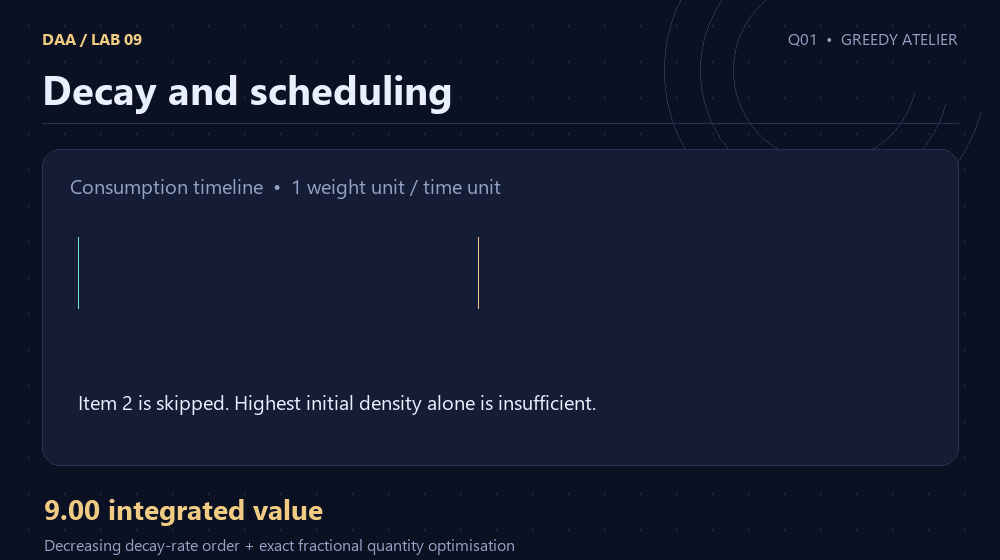</a><p><strong>Q01 · Decay and scheduling</strong></p></td><td width="50%"><a href="Q-2/README.md">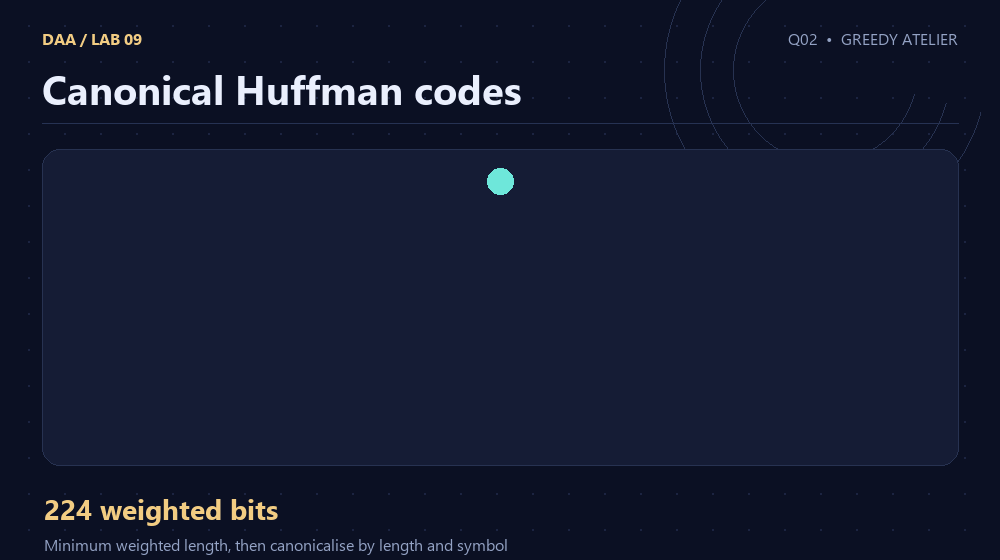</a><p><strong>Q02 · Canonical Huffman codes</strong></p></td></tr>
<tr><td width="50%"><a href="Q-3/README.md">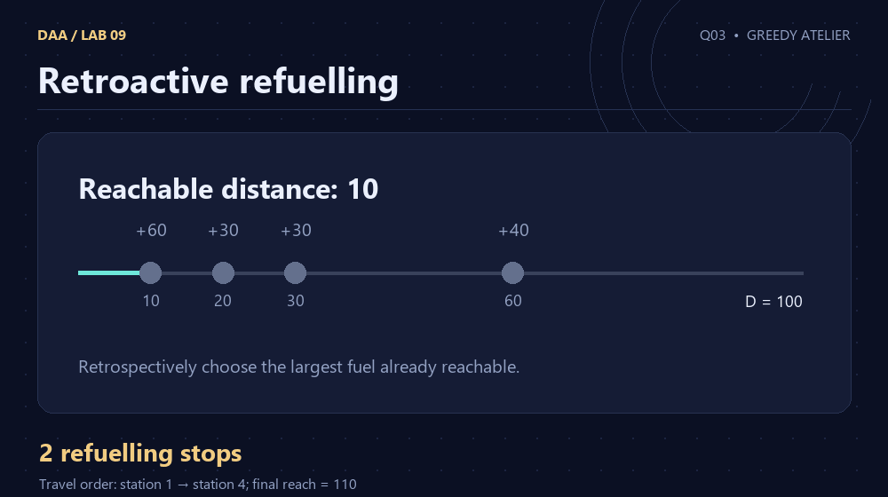</a><p><strong>Q03 · Retroactive refuelling</strong></p></td><td width="50%"><a href="Q-4/README.md">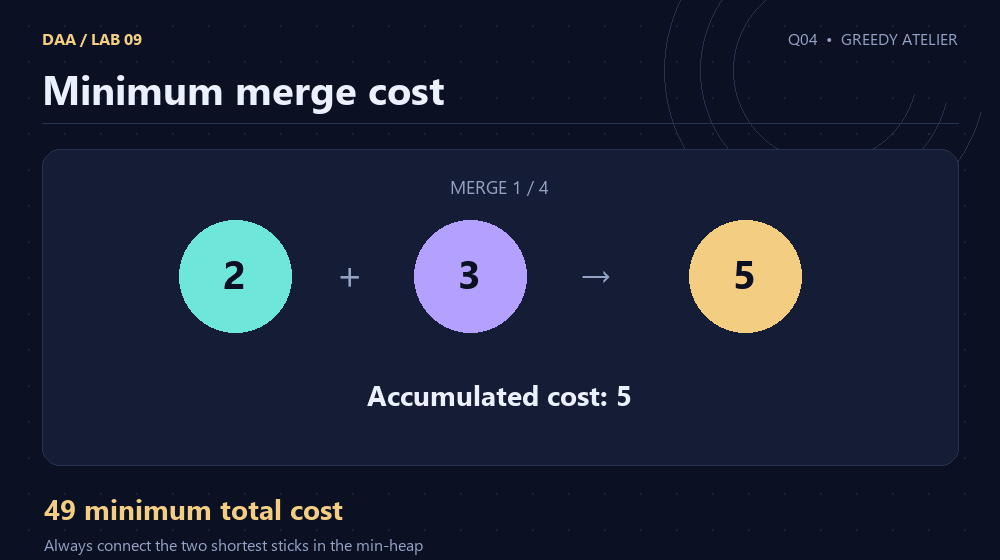</a><p><strong>Q04 · Minimum merge cost</strong></p></td></tr>
<tr><td width="50%"><a href="Q-5/README.md">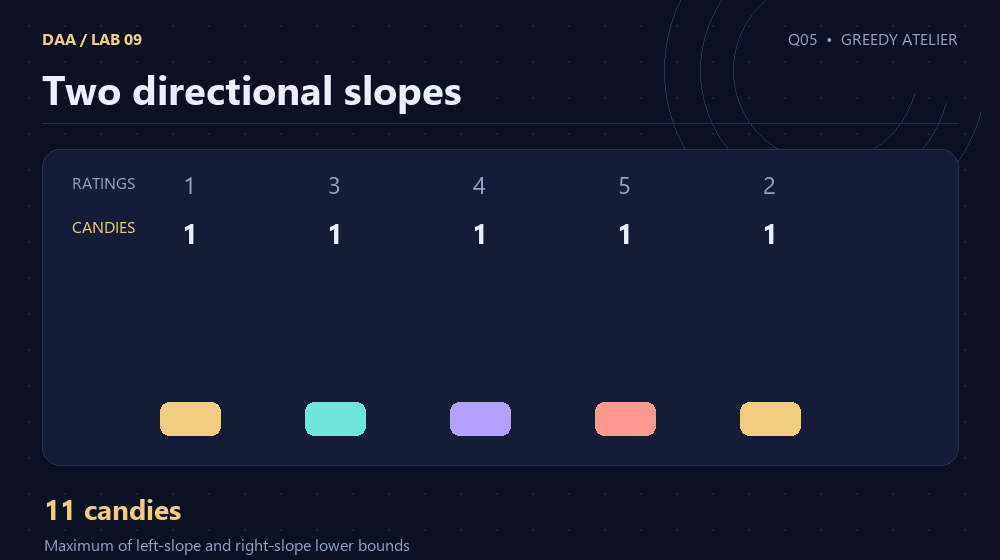</a><p><strong>Q05 · Two directional slopes</strong></p></td><td width="50%"><a href="Q-6/README.md">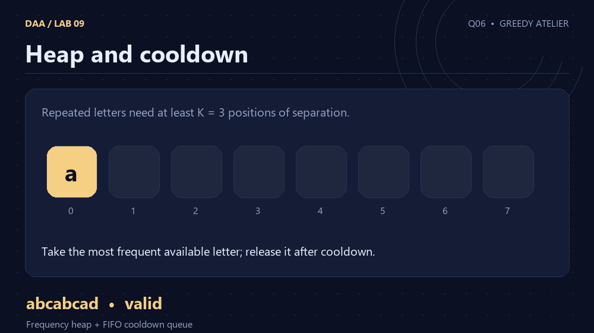</a><p><strong>Q06 · Heap and cooldown</strong></p></td></tr>
<tr><td width="50%"><a href="Q-7/README.md">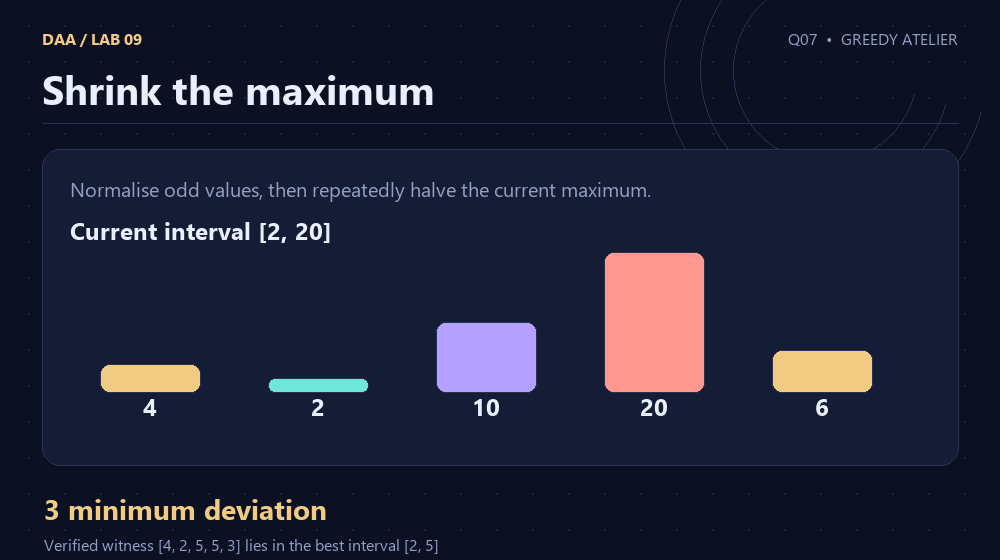</a><p><strong>Q07 · Shrink the maximum</strong></p></td><td width="50%"><a href="Q-8/README.md">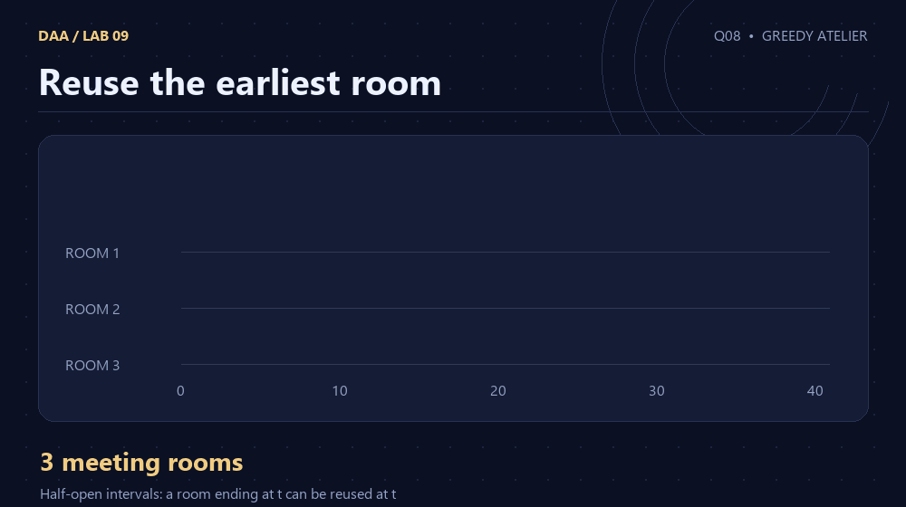</a><p><strong>Q08 · Reuse the earliest room</strong></p></td></tr>
<tr><td width="50%"><a href="Q-9/README.md">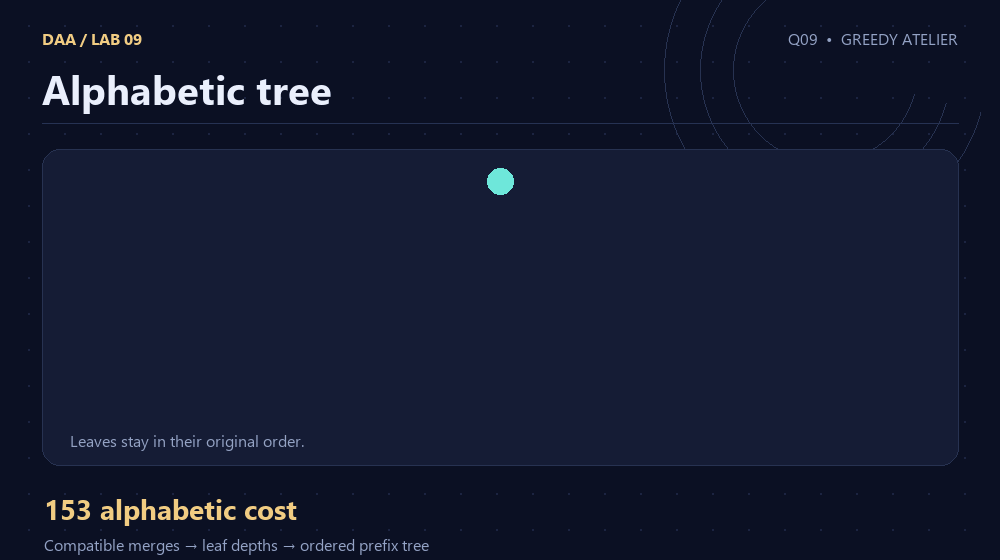</a><p><strong>Q09 · Alphabetic tree</strong></p></td><td width="50%"><a href="Q-10/README.md">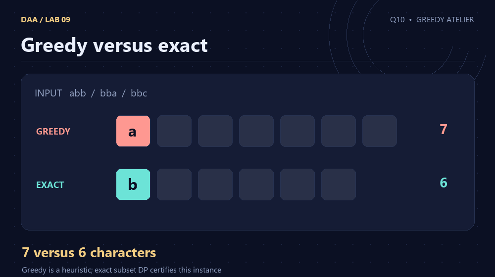</a><p><strong>Q10 · Greedy versus exact</strong></p></td></tr>
</table>

## Reproduce the work

From the repository root, using Python 3 and GCC/Clang:

```sh
python3 lab9/tools/build.py
python3 lab9/tools/validate.py
python3 lab9/tools/generate_evidence.py
```

Windows: replace `python3` with `py`, or run `lab9/build_windows.bat`. No third-party Python package is needed for building or checking the C programs. `CC=clang` selects Clang on Linux. To regenerate artwork, install `lab9/requirements-art.txt` and run `python3 lab9/tools/generate_visuals.py`.

## Evidence and sources

[Official question sheet](Problem-Sheet-Lab-09.pdf) · [Input formats](INPUTS.md) · [Verification record](VERIFICATION.md) · [Core result](verification.json) · [Scaling inputs and results](scaling_evidence.json)

Charts show instrumented operation counts; animations illustrate checked samples. Scientific bounds are derived in each README. A graph of one deterministic input family is not a proof of worst-case complexity.

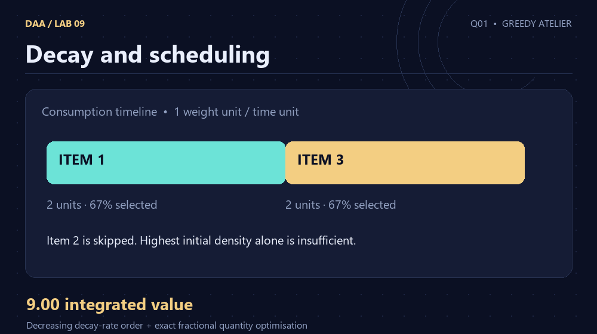
